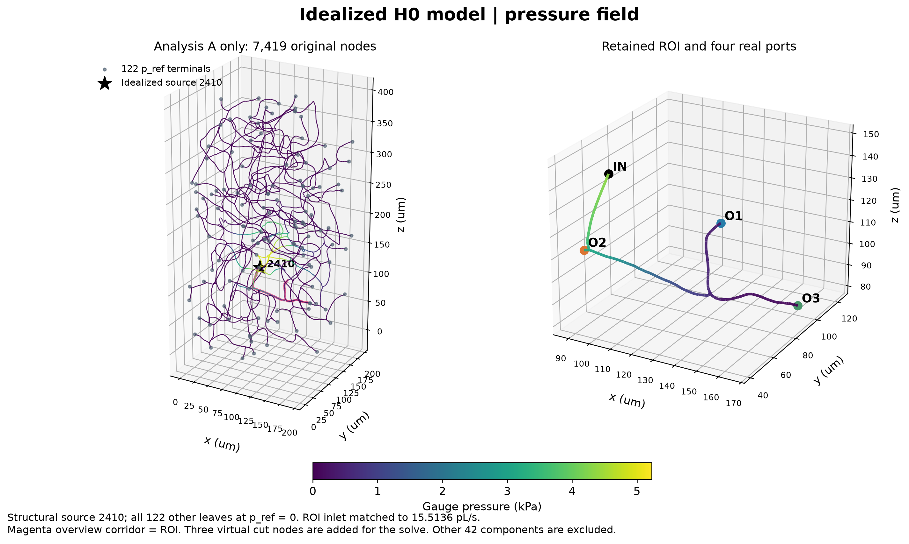
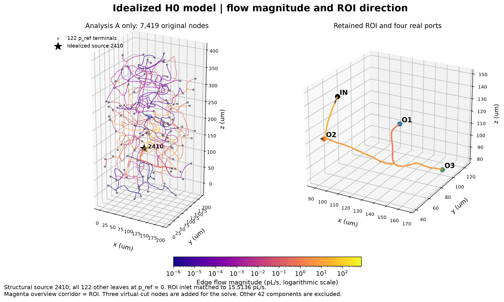

# 一句话结论

H0 下 O1/O2/O3 = **6.3023% / 49.5900% / 44.1077%**，相比原 3D 的 4.257917% / 85.205026% / 10.537057%，O2 优势明显改变：下降 35.6150 个百分点，仍是最大单一出口，但与 O3 已接近。独立新 3D 验证通过。O1/O2/O3 = 6.5408% / 44.8201% / 48.6391%；全局相对质量残差 0.000e+00，低于原阈值 1e-6。第 70 步满足连续 5 个稳态区间，第 71 步结束。

当前阶段：**A_NETWORK_H0_3D_VALIDATED**。

本轮采用理想化模型：2410 为主动指定的水力源点，其余 122 个结构叶节点为 p_ref=0 Pa 的参考压力终端；0 Pa 是表压基准。这些定义均不是生理标注，结果不代表真实小鼠脑循环 ground truth。

# 这一轮改变了什么

采用透明的 idealized hydraulic baseline 来回答当前几何中的模型问题；不再追求不存在的真实边界标注。复用 v1 provenance、analysis A、精确虚拟切点、SI、阻力积分和稀疏求解基础。未修改 Particle、原 production flow 或 v1 报告。

# 2410 为什么可以使用

2410 是 structural root，本轮主动定义它为理想化水力源；没有证明它是真实动脉。源 1 Pa 时 ROI 入口为 2.968457224259e-18 m³/s，方向正确。λ=5226.146254567 使 ROI 入口匹配 15.5135916044 pL/s，源表压得到 5226.146255 Pa，这是该模型的压力尺度。

# terminal 为什么全部设 0

除 2410 外所有 degree=1 节点共 122 个，统一作为参考压力端口，便于可重复地闭合管网。0 是 gauge/reference，不是真实组织压力。O3 原节点 4484 就是其中一个端点，其 real-cut 压力为 0 是定义结果；没有可从 A 推导的有限 downstream R3。

# 完整 A 如何决定 ROI pressure

把 A 看成相互连通的细水管。每段的长度和半径决定阻力；流量在分叉处连续，流经管段会损失压力。ROI 外仍保存的 O1、O2 管段将真实切点与参考端相连，所以二者切点有不同压力。O3 切点就是参考端。只解 analysis A 的 7419 原节点，不把其它 42 个分量混入。

# ROI operating point

| 端口 | 真实切点表压 Pa | 有符号流量 m³/s | 流量 pL/s | Q/Q_ROI | 圆管平均速度估计 mm/s |
|---|---|---|---|---|---|
| INLET | 4364.74841318 | 1.551359160440e-14 | 15.513591604 | 100.000000% | 1.9597241 |
| O1 | 342.34140101 | 9.777176251949e-16 | 0.977717625 | 6.302329% | 0.2259794 |
| O2 | 3065.60799923 | 7.693191550498e-15 | 7.693191550 | 49.590010% | 1.8424948 |
| O3 | 0.00000000 | 6.842682428710e-15 | 6.842682429 | 44.107661% | 1.3828945 |

全 A 源入流为 765.226012 pL/s；ROI 入口只有 15.513592 pL/s。三出口均向外，无 backflow。内部节点最大绝对不平衡 1.060308e-25 m³/s，RMS 4.058759e-27 m³/s；相对于全 A 源流量的最大节点残差 1.385614e-13。全 A 源入流 7.652260120875e-13 m³/s，终端总出流 7.652260120875e-13 m³/s，全局相对残差 3.615524e-14。ROI 相对残差 3.050980e-15，目标流量相对误差 0.0。小的非零残差全部保留。

# O2=85% 到底有多少是 ROI 边界造成的

| 出口 | 当前 3D % | H0 % | 变化 百分点 | 相对变化 % |
|---|---|---|---|---|
| O1 | 4.257917 | 6.302329 | +2.044412 | +48.014376 |
| O2 | 85.205026 | 49.590010 | -35.615016 | -41.799197 |
| O3 | 10.537057 | 44.107661 | +33.570604 | +318.595640 |

在保持同一 geometry、mesh、入口、μ、ρ、WALL、P1/P1+VMS 和数值设置的受控比较中，O2 从 85.205026% 变为 44.820122%，改变 -40.384905 个百分点（相对变化 -47.3973%）。这是本次理想化压力替换在当前 3D 模型中的出口边界效应。它说明原 O2≈85% 对等出口压力条件敏感；不能把这一变化比例推广为真实脑血流中“边界造成的比例”。

# terminal sensitivity

全部 122 个 leave-one-terminal-out 变体均重算并匹配同一 ROI 流量。大多数几乎不改变 ROI，但三个局部终端强烈影响分流：移除 4461 时 O2 接近零；移除 4484 时 O3 为零，O2 变为 69.1305%。O2 最坏变化 49.5900 个百分点。应同时看最坏情形与分位数，不能只看几乎不变的中位数。详见 [敏感性报告](TERMINAL_RADIUS_SENSITIVITY_ZH.md)。

# radius sensitivity

全局半径 0.90–1.10 倍实际数值验证了分流不变、压力按 a⁻⁴ 改变。O2 外部半径 −5% / +5% 则使 O2 分流改变 −4.9730 / +4.7127 个百分点；局部半径误差仍重要。O3 下游为 N/A。

# network pressure 如何传到 FEM cap

真实切点压力不能直接复制到人工延长段端盖。分别扣除 52.6273 / 429.1650 / 295.5723 Pa 压降，再共同加 295.5723 Pa。最终端盖压力 **585.286433 / 2932.015271 / 0 Pa**。40→160 截面的阻力估计变化均小于 0.04%，但圆管近似仍有模型误差。详见 [压力传递报告](NETWORK_TO_FEM_PRESSURE_TRANSFER_ZH.md)。

# 新 3D FEM

独立新 3D 验证通过。O1/O2/O3 = 6.5408% / 44.8201% / 48.6391%；全局相对质量残差 0.000e+00，低于原阈值 1e-6。第 70 步满足连续 5 个稳态区间，第 71 步结束。

新 case：`/home/lzy/projects/ulm_flow_mean_2p0_mmps/formal_3D_flow_solver/FEM_SimVascular/flow_cases/mean-2p0-mmps-A-H0-pressure-v1`。服务器独立目录：`/workspace/flow_mean_2p0_mmps_A_H0_20260924T181140Z`。原 case 的网格、geometry、入口、μ、ρ、WALL、求解器和数值参数保持不变，仍是 P1/P1 + VMS。配置审计只允许三个 outlet Value；其中 O3 数值仍为零。全局 mass_limit 仍为 1e-6，未增加任意内部截面 1e-6 门槛。

[三代分流主图](figures/06_three_way_flow_split.png) · [3D 验证](ROI_3D_A_H0_PRESSURE_VALIDATION_ZH.md)

# 1D/0D 与 3D 为什么不同

1D/0D 是 Poiseuille 圆管网络近似；3D 含真实接头、曲率、非圆截面、三维发展和人工延长段。固定压力传递基于 H0 工作点，并不随新 3D 流量迭代更新。两者分流不要求严格相等，主要受控比较是旧 3D 与新 3D。

# 当前最主要限制

结构 root 和 leaves 是模型边界假设；没有真实压力或入口标注。SWC 树不等于完整生理连通图，几何截断和局部半径不确定性仍存在。少数局部终端删除会改变路由。人工段压力损失用等面积圆管近似。既有 P1/P1+VMS 内部局部质量守恒问题属于独立限制，本轮没有用速度重建来混合改变变量。

# 下一步

1. 审核固定压力下的新 3D 分流及其与 H0 的差异。
2. 如需进一步降低边界假设依赖，再单独研究多端口耦合与局部半径/终端不确定性。
3. 审核完成后再另行决定 Particle 接入；本轮未运行 Particle。
