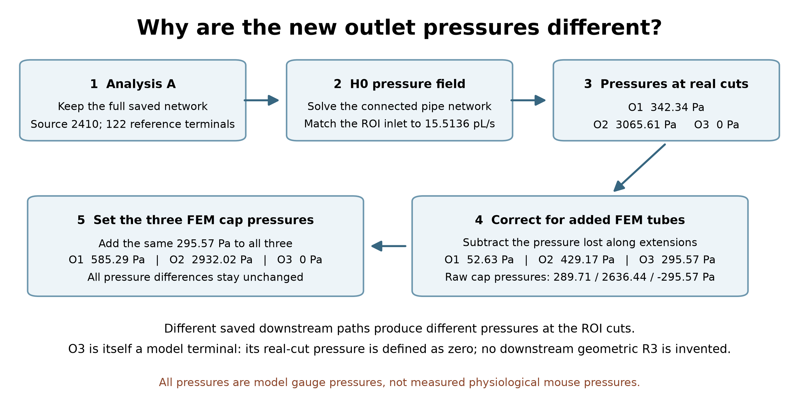

# 从 analysis A 真实切点到 FEM 人工端盖

本轮采用理想化模型：2410 为主动指定的水力源点，其余 122 个结构叶节点为 p_ref=0 Pa 的参考压力终端；0 Pa 是表压基准。这些定义均不是生理标注，结果不代表真实小鼠脑循环 ground truth。

网络压力属于 **REAL_A_NETWORK_CUT**，FEM 出口面位于 **FEM_ARTIFICIAL_EXTENSION** 的远端。沿出口 outward 方向使用有符号 Q：`p_cap_raw = p_real_cut - R_extension * Q_outward`。正向出流沿延长段压降，反向流则反号；不能直接复制真实 cut 压力。

| 端口 | R_extension Pa·s/m³ | H0 Q pL/s | 真实切点 Pa | 延长段压降 Pa | 原始端盖 Pa | 平移后端盖 Pa |
|---|---|---|---|---|---|---|
| O1 | 5.382667221e+16 | 0.977717625 | 342.341401 | 52.627286 | 289.714115 | 585.286433 |
| O2 | 5.578504626e+16 | 7.693191550 | 3065.607999 | 429.165047 | 2636.442953 | 2932.015271 |
| O3 | 4.319538740e+16 | 6.842682429 | 0.000000 | 295.572318 | -295.572318 | 0.000000 |

共同减去最小原始端盖压力 −295.572318375502 Pa，等价于给三端盖都加 295.572318375502 Pa，得到 **585.286433259832 / 2932.015271078201 / 0 Pa**。所有两两压差的保持误差最大 4.547474e-13 Pa，仅为浮点舍入。

# 延长段估计与量级

在当前冻结的 FEM exterior surface 上，沿 v1 确认的真实 cut→cap 轴向长度，取 40 个等距半格中心截面。通过 VTK 交线的闭合多边形计算面积，换算等面积圆半径，复用 v1 解析线性半径阻力积分；两端半格采用最近截面半径闭合，覆盖完整长度。每个截面必须唯一、闭合，不使用缺失几何的猜测替代。[截面与网格 SHA](data/current_FEM_extension_sections.json) 保留全部数值。

40→160 截面加密核查：

| 端口 | 160 截面 R Pa·s/m³ | 相对 40 截面的改变 |
|---|---|---|
| O1 | 5.384819003e+16 | +0.039976% |
| O2 | 5.579015194e+16 | +0.009152% |
| O3 | 4.320260321e+16 | +0.016705% |

这验证了本几何下的轴向积分稳定性，不消除等效圆管 Poiseuille 对非圆截面、三维发展和接头效应的模型误差。实际 case 使用声明的 40 截面估计。

真实切点 O2−O1 压差为 2723.266598 Pa，延长段修正使它减少 376.537760 Pa，约 13.827%。O1−O3 压差由 342.341401 Pa 变为 585.286433 Pa，修正达 242.945032 Pa，约原差值的 70.97%。因此不能声称这些延长段修正可以忽略。

# O1/O2 外部阻力审计与 O3 闭合

O1 外部保存了 61 条边、1 个参考终端，独立单位端口压力求解得到 R=3.501434281064e+17 Pa·s/m³；与 full-A 的 p/Q 相对差 6.068e-14。O2 外部保存了 76 条边、1 个参考终端，R=3.984832535503e+17，相对差 8.898e-14。这些是对已存几何的等效阻力审计；本次 FEM 使用 fixed pressure，未改成 coupled resistance。

O3：`geometry-derived downstream R3 = NOT_AVAILABLE`。H0 closure 为 `Dirichlet p_ref terminal`，真实 cut 压力 0 Pa。人工延长段 R_extension 仍可估计，必须与不存在的 A 下游 R3 区分。

# 写入 FEM 的边界语义

保持原 `Type=Neu`、`Time_dependence=Steady`，仅替换三个出口 `Value`；O3 平移后仍为零，实际数值变动只有 O1、O2。源代码的稳态 Neu 分支将正的压力值转换为负外法向 traction（`set_bc_neu_l` 的 `hg=-h*gx`），故无需再人为反号。它是给定压力牵引，不是每个端面节点的 pressure Dirichlet；求解出的面积平均压力可因黏性法向牵引而略不同。

FEM 保留原入口 XML 的 1.551359160886e-14 m³/s，网络匹配的是实测 1.551359160440e-14 m³/s；既有差别仅约 2.87e-10 相对量，不能为了抹去这一差别而额外修改入口。

此次是单次 H0 工作点压力传递。若新 3D 分流不同，它不会迭代更新 R_extension*Q，也不等价于一个与全 A 实时耦合的多端口阻力边界。

[压力传递 JSON](data/network_to_fem_pressure_transfer.json) · [可写入 BC JSON](data/roi_fixed_pressure_bc_H0.json) · [case 配置审计](data/3d_case_config_diff.json)

