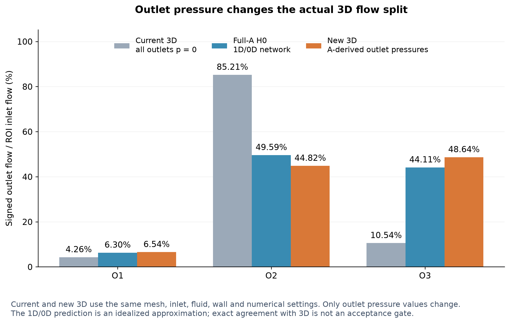

# 新 3D FEM 独立验证

**PASS / A_NETWORK_H0_3D_VALIDATED**。本轮采用理想化模型：2410 为主动指定的水力源点，其余 122 个结构叶节点为 p_ref=0 Pa 的参考压力终端；0 Pa 是表压基准。这些定义均不是生理标注，结果不代表真实小鼠脑循环 ground truth。

独立新 3D 验证通过。O1/O2/O3 = 6.5408% / 44.8201% / 48.6391%；全局相对质量残差 0.000e+00，低于原阈值 1e-6。第 70 步满足连续 5 个稳态区间，第 71 步结束。

| 出口 | 当前 3D % | Full-A H0 % | 新 3D % | 新−旧 3D 百分点 | 新 3D−H0 百分点 |
|---|---|---|---|---|---|
| O1 | 4.257917 | 6.302329 | 6.540825 | +2.282908 | +0.238495 |
| O2 | 85.205026 | 49.590010 | 44.820122 | -40.384905 | -4.769888 |
| O3 | 10.537057 | 44.107661 | 48.639054 | +38.101997 | +4.531393 |

在保持同一 geometry、mesh、入口、μ、ρ、WALL、P1/P1+VMS 和数值设置的受控比较中，O2 从 85.205026% 变为 44.820122%，改变 -40.384905 个百分点（相对变化 -47.3973%）。这是本次理想化压力替换在当前 3D 模型中的出口边界效应。它说明原 O2≈85% 对等出口压力条件敏感；不能把这一变化比例推广为真实脑血流中“边界造成的比例”。

# 数值、几何与边界验收

| 端口 | 有符号约定 | 流量 m³/s | 流量 pL/s |
|---|---|---|---|
| INLET | 进入 ROI 为正 | 1.551359160440e-14 | 15.513591604 |
| OUTLET_01 | 离开 ROI 为正 | 1.014716809840e-15 | 1.014716810 |
| OUTLET_02 | 离开 ROI 为正 | 6.953210612489e-15 | 6.953210612 |
| OUTLET_03 | 离开 ROI 为正 | 7.545664182073e-15 | 7.545664182 |

出口总流量 1.551359160440e-14 m³/s；原生产双精度求和方法的全局相对质量残差 **0.000000000e+00**，入口目标相对误差 2.870457374e-10。这两项均用原入口指定流量作分母并满足原阈值 1e-6。对同一组四个有符号边界通量作补偿求和，残差为 7.888609052210e-31 m³/s，相对量 5.084966300e-17；普通求和显示的零来自浮点舍入，没有人工归零，也不意味着任意内部截面严格守恒。端口反流判定：{'OUTLET_01': False, 'OUTLET_02': False, 'OUTLET_03': False}。有符号 fraction 使用 actual Q_in 作分母，另保存正出流归一化比例。

压力范围 -1.85810514 到 4985.08092396 Pa，速度、压力均有限；WALL 最大速度 0.000000000e+00 m/s，小于 2.000000000e-13 m/s，no-slip PASS。给定的是 Neu 压力牵引，面积平均 p 不需逐点等于指定压力。

原生 solver exit code=0；native log 独立重解析后线性与非线性 convergence PASS。每 10 步保存，最后连续 5 个区间满足 E_u≤1e-5、E_Q≤1e-6；第 70 步首次达标，最终第 71 步。停止后的速度相对变化 4.313934e-15，归一化通量变化 1.016993e-16。本次失败的最终线性求解数为 0，已恢复的 ILU 重试数为 0。原始求解日志完整保留。

网格节点 70363、四面体 371402。验证坐标顺序、单元连通、mesh/exterior/WALL 的 SHA 与原 case 一致：

| 输入 | SHA256 |
|---|---|
| mesh | 1a7a69dcba52f0475b2280775921e4dedcdfefa67b7965096d86cb9dba38bdf9 |
| exterior geometry | e49c1bcd14283e8d1476311232f206b45f09695cc562f8db3d3d2d518f5378f5 |
| WALL | 06c5d1d1975cf9470096d9b7e560e2173c9733c847d5bc364aab7355ef12a11b |

配置比较 [3d_case_config_diff.json](data/3d_case_config_diff.json) 证明唯一允许字段是 O1/O2/O3 outlet Value；O3 数值维持零。未切换 FEM formulation，未做 conservative velocity reconstruction，未将内部任意截面误差作为本轮 gate。

# 1D/0D 与 3D 的差异

新 3D−H0 的分流差为 +0.238495 / -4.769888 / +4.531393 个百分点。圆管网络近似和三维接头、曲率、非圆截面、发展段的差异允许造成不一致。H0 端盖压力在其工作点计算后固定，未强迫 FEM 重现网络流量；严格相等不作为验收标准。

# 运行与保留结果

1 MPI rank，OMP_NUM_THREADS=1；复用原 GPU/PETSc 配置。服务器求解耗时 1674.542 s（27.91 min）。5 秒采样的进程树峰值 RSS 3244.16 MiB，最大单进程 VmHWM 2954.70 MiB，wait4 子进程 maxrss 2956.91 MiB；采样峰值不宣称捕获采样间瞬时总峰值。完整环境见新 case 的 reports/host.json。

服务器：`/workspace/flow_mean_2p0_mmps_A_H0_20260924T181140Z`。

本地独立 CFD 场：`/home/lzy/projects/ulm_flow_mean_2p0_mmps/formal_3D_flow_solver/FEM_SimVascular/flow_cases/mean-2p0-mmps-A-H0-pressure-v1/frozen_flow/steady_flow_mean_2p0_mmps_A_H0.vtu`。该文件是实际最终 native VTU 的逐字节副本，附带 SI 数组、checkpoint 和 SHA manifest；没有由旧场缩放生成。结果未晋升为 Particle production，未执行任何 Particle。

[独立验收 JSON](data/3d_physics_validation.json) · [主审阅报告](A_NETWORK_H0_REVIEW_ZH.md)
