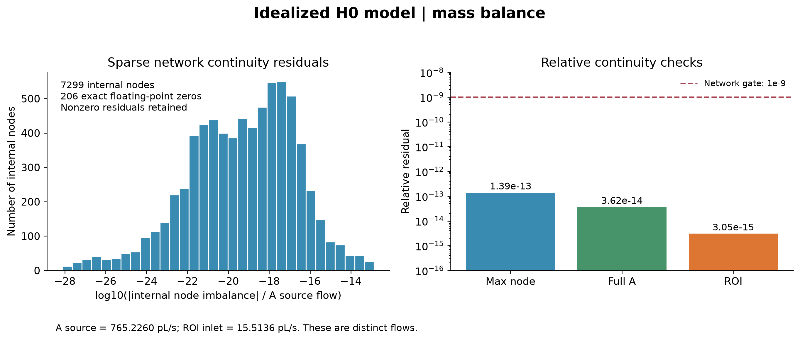
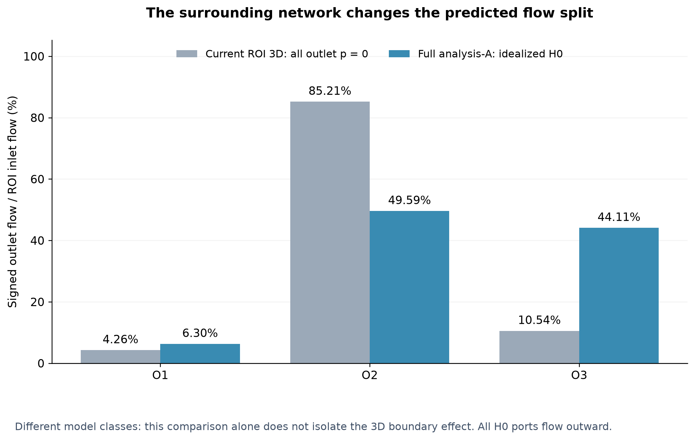

# ROI H0 工作点

本轮采用理想化模型：2410 为主动指定的水力源点，其余 122 个结构叶节点为 p_ref=0 Pa 的参考压力终端；0 Pa 是表压基准。这些定义均不是生理标注，结果不代表真实小鼠脑循环 ground truth。

| 端口 | 真实切点表压 Pa | 有符号流量 m³/s | 流量 pL/s | Q/Q_ROI | 圆管平均速度估计 mm/s |
|---|---|---|---|---|---|
| INLET | 4364.74841318 | 1.551359160440e-14 | 15.513591604 | 100.000000% | 1.9597241 |
| O1 | 342.34140101 | 9.777176251949e-16 | 0.977717625 | 6.302329% | 0.2259794 |
| O2 | 3065.60799923 | 7.693191550498e-15 | 7.693191550 | 49.590010% | 1.8424948 |
| O3 | 0.00000000 | 6.842682428710e-15 | 6.842682429 | 44.107661% | 1.3828945 |

三出口均为正向出流，无端口 backflow。Q1+Q2+Q3=1.551359160440e-14 m³/s，与入口 1.551359160440e-14 m³/s 一致至数值求解精度。分流分母统一为 Q_ROI_in；机器数据同时保留 positive-outflow normalized fraction。

表中速度由各真实 cut 的 SWC 半径以 Q/(πr²) 估计。入口得到 1.9597241 mm/s，与 FEM 端面实际面积定义的 2.0 mm/s 不同，是面积定义和几何位置的差别；匹配的是已经验证的 ROI 流量，不修改 FEM 入口。

# 单位压力与缩放

单位源压力 1 Pa 时 ROI 入口 Q=2.968457224259e-18 m³/s；λ=5226.146254566908；缩放源压力=5226.146254567 Pa。它是理想化 H0 在指定工作点下的 gauge pressure scale，不能解读为真实小鼠动脉压力。全 A 入流 765.226012087 pL/s，远大于穿过该 ROI 的 15.513591604 pL/s。

# 与当前 3D 参考比较

| 出口 | 当前 3D % | H0 % | 变化 百分点 | 相对变化 % |
|---|---|---|---|---|
| O1 | 4.257917 | 6.302329 | +2.044412 | +48.014376 |
| O2 | 85.205026 | 49.590010 | -35.615016 | -41.799197 |
| O3 | 10.537057 | 44.107661 | +33.570604 | +318.595640 |

O2 仍为 H0 中最大的单一出口（49.5900%），但 O3 已达 44.1077%，原先 85.2050% 的强优势显著改变。描述上属于 C（优势显著改变），并保留“仍略高于 O3”的事实；没有为 A/B/C/D 强设阈值。

# 数值守恒

内部节点最大绝对不平衡 1.060308e-25 m³/s，RMS 4.058759e-27 m³/s；相对于全 A 源流量的最大节点残差 1.385614e-13。全 A 源入流 7.652260120875e-13 m³/s，终端总出流 7.652260120875e-13 m³/s，全局相对残差 3.615524e-14。ROI 相对残差 3.050980e-15，目标流量相对误差 0.0。小的非零残差全部保留。

[审计 JSON](data/network_mass_balance_audit.json) 保存稀疏求解诊断。[独立重加和审计](data/independent_scaled_flow_mass_audit.json) 直接从已缩放边流量重新累加，最大相对节点残差约 1.386e-13，确认没有靠人工归零得到结果。

