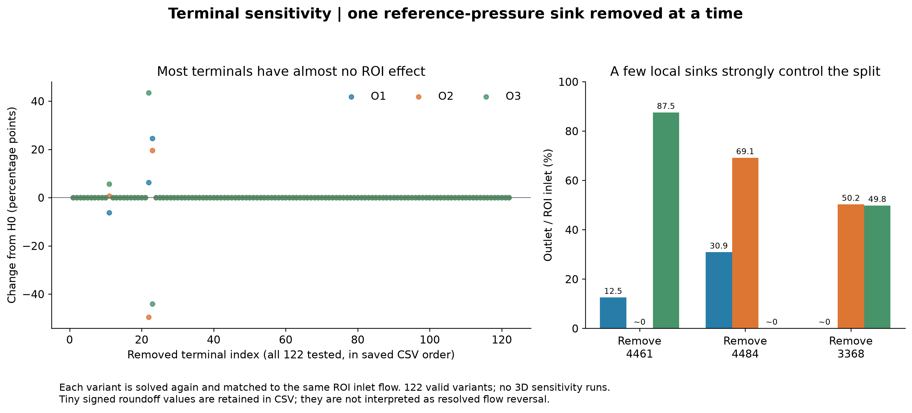

# H0 的终端与半径敏感性

本轮采用理想化模型：2410 为主动指定的水力源点，其余 122 个结构叶节点为 p_ref=0 Pa 的参考压力终端；0 Pa 是表压基准。这些定义均不是生理标注，结果不代表真实小鼠脑循环 ground truth。

# 逐一移除终端

每次只取消一个终端的 p=0 Dirichlet 条件，把它作为没有源汇的自由叶节点，其连续性条件就是 zero-flow；其余终端维持原条件。每个变体重新做单位压力稀疏求解，再重新匹配同一个 ROI inlet Q。122 个变体全部有效，无 INVALID_VARIANT；未运行任何敏感性 3D case。

| 出口 | H0 % | 最小 % | 最大 % | P05 / P50 / P95 % | 影响最大终端 | 最大绝对变化 百分点 |
|---|---|---|---|---|---|---|
| O1 | 6.302329 | -7.0262334e-13 | 30.869454 | 6.302329 / 6.302329 / 6.302329 | 4484 | 24.567125 |
| O2 | 49.590010 | 3.49121239e-09 | 69.130546 | 49.590010 / 49.590010 / 49.590010 | 4461 | 49.590009 |
| O3 | 44.107661 | 0 | 87.497857 | 44.107661 / 44.107661 / 44.107661 | 4484 | 44.107661 |

P05/P50/P95 是这个有限、确定性的“逐一删除”集合的分位数，不是生理置信区间。119 个非局部终端在固定 ROI 入口流量后几乎不影响下游分流；由树结构、单入口 ROI 与三个下游终端的拓扑可解释这一现象。分位数因此几乎都落在 baseline，不能用它掩盖最坏情形。

| 移除终端 | O1 % | O2 % | O3 % | 重新匹配所需源压力 Pa |
|---|---|---|---|---|
| 4461 | 12.5021433 | 3.49121239e-09 | 87.4978566 | 8510.318911 |
| 4484 | 30.8694539 | 69.1305461 | 0 | 6541.645788 |
| 3368 | -7.0262334e-13 | 50.2331733 | 49.7668267 | 5269.445051 |

移除 O1 对应的 3368、O2 对应的 4461 或 O3 本身 4484 都会改变路由。O2 在移除 4461 后数值上接近零；移除 4484 后 O2 升至 69.1305%，O1 升至 30.8695%。O1 最小有符号 fraction 为 −7.026233400379352e-15，这是未被归零的求解舍入量，不能解释为已解析的物理 backflow。所有精确符号和值保留在 [逐终端 CSV](data/terminal_leave_one_out_sensitivity.csv)。

结论：H0 对多数终端不敏感，但对决定 ROI 三条出路的少数局部终端很敏感，不能称为“对任意单终端假设都稳健”。

# 半径敏感性

| 作用区域 | 半径倍数 | 源压力 Pa | 源压力/H0 | O1 % | O2 % | O3 % | O2 变化 百分点 |
|---|---|---|---|---|---|---|---|
| GLOBAL | 0.9 | 7965.472115 | 1.524157903 | 6.302329 | 49.590010 | 44.107661 | -2.10942e-13 |
| GLOBAL | 0.95 | 6416.336590 | 1.227737663 | 6.302329 | 49.590010 | 44.107661 | -1.17129e-12 |
| GLOBAL | 1.0 | 5226.146255 | 1.000000000 | 6.302329 | 49.590010 | 44.107661 | +0 |
| GLOBAL | 1.05 | 4299.563457 | 0.822702475 | 6.302329 | 49.590010 | 44.107661 | -3.27516e-12 |
| GLOBAL | 1.1 | 3569.528212 | 0.683013455 | 6.302329 | 49.590010 | 44.107661 | +2.66454e-12 |
| O1 | 0.95 | 5230.777676 | 1.000886202 | 5.628206 | 49.658805 | 44.712989 | +0.0687955 |
| O1 | 1.05 | 5221.692186 | 0.999147734 | 6.950638 | 49.523848 | 43.525513 | -0.0661611 |
| O2 | 0.95 | 5555.491623 | 1.063018781 | 6.924063 | 44.616994 | 48.458943 | -4.97302 |
| O2 | 1.05 | 4914.041724 | 0.940280177 | 5.713143 | 54.302693 | 39.984164 | +4.71268 |

全局半径统一乘 a 时所有阻力按 a⁻⁴ 缩放。实际重算 0.90/0.95/1.00/1.05/1.10 后，分流最大变化约 3.3e-12 个百分点，源压力比例与 a⁻⁴ 相符。它验证线性同质缩放，不表示对各支路独立的半径误差同样不敏感。

O1 和 O2 的“external branch”定义为去掉 ROI 内部边后，与各 cut 相连的保存外部分量。改变该分量内所有真实节点半径，**保持虚拟 real-cut 半径不变**，避免把 ROI 内部边一起改变；第一段外部边的线性半径因此连续过渡。O1 外部 ±5% 使其自身分流变化约 −0.6741 / +0.6483 个百分点；O2 外部 ±5% 使 O2 分流变化 −4.9730 / +4.7127 个百分点。

O3 downstream radius perturbation = N/A，原因是未保存任何 A 下游几何，而非假定某个人造 R3。人工 FEM 延长段不混入 A 几何半径敏感性。

[半径 CSV](data/radius_hydraulic_sensitivity.csv) 保存每次真实求解的源压力、ROI 入口压力、各出口压力、流量比例及变化；没有随机采样。
