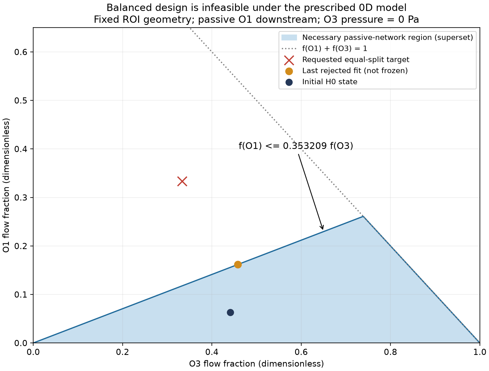

# 三出口均分设计：纯 0D 执行与不可达性报告

## 1. 结论与执行状态

**状态：BALANCED_0D_TARGET_NOT_REACHED。没有冻结新参数，没有 FEM handoff，没有创建或运行新 CFD。**

严格执行了 base 核对、旧测试、新配置和一次纯 0D 拟合。初始 Jacobian 满秩，末点秩降至 1；分流停在约 16.17% / 38.05% / 45.78%，不满足三等分验收。进一步从完整 A 几何中提取固定路径得到必要约束：`f_O1 <= 0.353208785100 f_O3`。三等分违反该约束，因此这不是单凭优化失败猜测不可达。按提示词第 8 节“如果无法达到，不要自动进入 CFD”及第 10 节“只在 freeze 完成以后实现/运行 handoff”，后续阶段均停止在前置门槛，未绕过。

**NEW SCIENTIFIC CFD RUN COUNT = 0；CFD-based parameter retuning = NO；Particle/RBC run count = 0。**提示词末尾期望的 run count=1 以此前验收通过为前提，本次不能据此虚报一次计算，亦不能让服务器运行未通过设计。

## 2. 版本、文件与只读范围

- 仓库：OZAKI39/ulm-3d-vascular-model-generation。
- base commit：`f43c09b1e55cbd9702a65c600a464154fcf346f3`。
- 分支：`sync/current-h0-dt1ms-wss-audit-20260927`。
- 工作树：`/home/lzy/projects/temp_storage/github_sync_20260927`。
- 新配置：`configs/parameterized_hydraulics/balanced_three_outlet_fit.yaml`。
- 新模块：`network_1d0d/balanced_feasibility.py`，提供失败即阻断的验收和固定路径必要条件证明。
- 新脚本：`scripts/diagnose_balanced_three_outlet.py`、`scripts/write_balanced_design_report.py`。
- 新测试：`tests/network_parameterized/test_balanced_design.py`。
- 新记录：`reports/parameterized_0d_v1/balanced_three_outlet/` 与本报告目录。

没有修改任何既有生产源码、配置、网格、H0/冻结参数/流场或粒子/RBC 结果。既有 optimizer 和解析阻力函数保持 base 版本；新增诊断不向 optimizer 反馈、不调用 CFD，也不修改任何半径文件。配置使用现有 parser 支持的 `SYNTHETIC_VERIFICATION` purpose，`evidence_reference` 显式说明 `SYNTHETIC_BALANCED_FLOW_DESIGN`，没有为本次目标改 parser。

## 3. 一次纯 0D 拟合的实际结果

目标是三出口各 1/3，sigma 各 0.005；属于设计/合成目标，不是实验或生理真值。完整网络仍为 7422 节点、7421 边。唯一自由参数是 `log(s_O1)` 和 `log(s_O2)`，初值均 1。固定 μ=0.00345312 Pa·s，Pd=0 Pa，O3=`legacy_reference`，入口目标 Q=1.551359160440232e-14 m³/s。

每次评估继续使用 `parameterized_hydraulics.py:232` 的完整网络求解路径，real-cut 半径和 ROI 内边不变；下游节点半径改变后重新调用 `linear_radius_resistance()`，没有直接调 outlet 阻力。

| 指标 | 记录 |
|---|---:|
| 拟合工作流次数 | 1 |
| 初始残差范数 | 66.6645585587 |
| 末点残差范数 | 43.4396556789 |
| 初始 J=sum(residual²) | 4444.16336783 |
| 末点 J | 1887.0036855 |
| 完整 trace 的实际 0D 评估数 | 130 |
| 其中 optimizer 阶段评估数 | 120 |
| 初始/最终数据 Jacobian 秩 | 2 / 1 |
| 最终奇异值 | [235.0675634250729, 3.956252737712355e-10] |
| 原 CLI exit code | 1：末点可辨识性检查主动拒绝 |
| SciPy nfev、success、终止消息 | 未保存，不编造；见下文 |

原 `parameter_fit.py:219` 在末点秩检查处抛出异常，尚未返回/写入 SciPy OptimizeResult，因此原输出没有 nfev 和 optimizer success。130 是 trace 的实际 residual evaluation 总数，包含初始/最终及差分调用，不能冒充 SciPy nfev。没有为了补该计数再次运行拟合。

末点参数（**被拒绝，绝非可用拟合参数**）：s_O1=177137796.28，s_O2=0.892944254358965。s_O1 的巨大值说明迭代逼近 O1 外部阻力为零的极限，不能解释为可信半径修正。该状态的导纳矩阵条件数估计约 1.713e+37，不宜据其微小残差宣称高精度；不可达结论另由固定几何的必要条件证明。

原始 `fit_rejection.json` 留有 `PRIOR_REGULARIZED_NOT_DATA_IDENTIFIED` 字符串，这是基线代码对最终数据秩不足的通用标签，**本次 prior_constraints=0，实际没有任何 prior**。准确含义为“最终秩不足，被拒绝”。原记录未被改写；补充汇总明确标出此局限。

以下是末点诊断状态，非 frozen prediction。全部压力为 real-cut 表压，流量向 ROI 外为出口正方向。

| 端口 | 压力 Pa | 流量 m³/s | 相对入口流量 |
|---|---:|---:|---:|
| INLET | 4976.47738722 | 1.551359160440e-14 | 100.0000000000% |
| O1 | 1.08530761293e-08 | 2.508501972251e-15 | 16.1697048383% |
| O2 | 3697.4670093 | 5.903052315649e-15 | 38.0508425526% |
| O3 | 0 | 7.102037316501e-15 | 45.7794526091% |

| 0D balance 指标 | 无量纲值 | 百分点尺度 |
|---|---:|---:|
| max_abs_deviation from 1/3 | 0.17163628495 | 17.16362850 |
| range | 0.296097477708 | 29.60974777 |
| std (population, ddof=0) | 0.125399484499 | 12.53994845 |

最大相对质量残差 1.7800e-13；无出口反流；半径与阻力全部 finite positive。**这些检查通过，不代表均分目标通过。**未经四舍五入的原始数值保存在 CSV/JSON。

## 4. 固定几何给出的不可达性证明

`balanced_feasibility.py:43` 从完整 A 图的 ROI 边掩码提取连接关系，验证其为四端口树（109 节点、108 边），并核对 J2 到 O1/O3 的两条路径没有旁支。J2 原始节点 ID=3274，坐标为 (130.04,82.04,87.18) μm。证书保存每条路径的节点 ID 和原始边索引。

用现有解析 taper law 逐边计算并累加，得到固定的 ROI 内部串联阻力：

- R(J2→O1)=2.378728826416807e+17 Pa·s/m³，34 条边。
- R(J2→O3)=8.401879188610662e+16 Pa·s/m³，23 条边。

两者是未参数化的 ROI 内阻力，**不是任意调节的出口等效阻力**。因为每条路径无旁支，沿途流量恒定，完整网络状态必然满足：

`P_J2 − P_O1 = R1 Q_O1`

`P_J2 − P_O3 = R3 Q_O3`

相减得到 `P_O1 − P_O3 = R3 Q_O3 − R1 Q_O1`。

O1 外部组件只连接 O1，内部全是正阻力、终端全固定在共同 Pd。正向出流要求 P_O1≥Pd；O3 固定在 Pd。因此：

`f_O1 / f_O3 ≤ R3/R1 = 0.353208785100016`。

三等分要求这个比值为 1，与必要条件矛盾。更直接地，令 Q_O1=Q_O3=Qin/3，会要求：

`P_O1 − Pd = (R3−R1) Qin/3 = -795.609843549542 Pa`。

问题不在于“负表压普遍不允许”，而在于该负压差与**正向出流、共同远端压力、被动正阻力**三项同时矛盾。统一改变压力参考零点不会改变这项压差，无法解决。改变 O2 下游尺度也不改变上述两条固定路径阻力。

在 O2 不反流时，还可得到 O1 分流保守上界 `k/(1+k)=0.261015734593`，即 **26.101573%**，仍小于 33.3333%。所有满足必要条件的三分流，其最大均分偏差至少为 `(1−k)/(3(1+k))=0.159322843605`，远高于 1e-5 验收阈值。

相同 sigma 的最小二乘目标在这个更大的必要可行域上的边界投影为 `[0.1616970483999667, 0.38050842546960284, 0.4577945261304305]`。实际失败末点与其最大分流差仅 5.6676e-11。这说明优化结果与几何极限一致；投影本身不被声称为有限、合理的半径参数解。



蓝色区域只表示必要条件允许的**更大集合**，不是完整参数映射的充分可行域。红叉位于其外，足以排除目标；橙点为未冻结的失败末点。

## 5. 补充数值检查与服务器资源

没有重跑 optimizer。诊断脚本对末点作 1 次完整网络重建，并固定其 s_O2、用 s_O1=1/2/5/10/100/10000 作 6 次纯 0D 灵敏度检查，全部验证固定路径等式、分流比值上界及质量守恒；逐项数值见 `saturation_checks.csv`。这不是 CFD sweep，不更新设计配置或接受参数。新增测试另有小规模纯 0D 验证，不运行 CFD。

已通过 SSH 只读检查服务器 `f7c62a262077`，GPU 为 `NVIDIA GeForce RTX 4090, 595.84, 24564 MiB, 0 %`；CPU 配额 `768000 100000`，内存上限 45156925440 bytes。未部署或注册后台 CFD 启动程序。

原 H0 源算例：`/workspace/flow_mean_2p0_mmps_A_H0_20260924T181140Z/mean-2p0-mmps-A-H0-pressure-v1`。输入哈希逐一匹配既有清单。求解器 SHA256：`0e509fe21424b5b1f731c4b4f519839b0104bfb2aab0817b01556cc4054f7fc7`；PETSc 3.25.5 库 SHA256：`b79e98d278e105aa8a1848bd08d66ef36a3e2425458610f97213d3fc8e45c5ef`。已验收设置包含 `-mat_type aijcusparse -vec_type cuda`、GPU 0、MPI 1、OMP 1、ASM/ILU 预条件器；它是 CPU/GPU 混合路径，不能称全部工作都在 GPU。

原 H0 policy 的 dt=1.5040600916882215e-07 s，入口 Q=1.5513591608855429e-14 m³/s。这里报告的是实际源算例配置，不根据分支名假定 CFD dt=1 ms。它们未被改变。由于 0D 失败，**没有本轮 GPU 求解使用率、CFD wall time 或最终步数**；可用设备不能替代科学验收门槛。

## 6. 测试、未执行项与交付状态

原测试：**103 passed in 7.11s**。新增测试后：**115 passed in 6.28s**。

新增覆盖：目标仅两个自由参数、均分所需负压差、固定路径与完整网络相符、显式 μ、压力零点不解除约束、拒绝冻结、不能仅靠 success 标签放行、失败末点与解析极限吻合、无 CFD 反馈/自动启动。

这次没有把“均分拟合达到目标”测试伪写为通过；通过的是“该配置不可达且系统正确阻断”的测试。handoff 保压差/使用 μ、仅三个 XML 值改变、恰好创建一个科学 CFD 算例等测试，因相应阶段按顺序未获准进入而未实现/未运行，不能计作通过。

| 交付项目 | 本次状态 |
|---|---|
| balanced config / trace / rejection / failure summary | 已保存 |
| network_state_si.npz | 已保存；内置 `REJECTED_DIAGNOSTIC_ONLY_NOT_FROZEN` 标志 |
| frozen_parameterized_boundary.yaml | 未生成：0D FAIL |
| FEM extension R、raw/applied cap P、handoff JSON | 未生成：必须先 freeze |
| 唯一 FEM case path、XML diff | 不存在：未创建新算例 |
| CFD exit code / wall time / final step / steady gates | N/A：没有启动 CFD |
| 最终 3D 分流、平衡指标及 0D→3D 差异 | N/A：没有新 3D 结果 |
| new 3D 与 old H0 3D 比较 | 未执行，不能称改善或不改善 |
| 新 frozen flow 路径及 SHA256 | 不存在 |
| 新科学 CFD 运行次数 | **0** |
| CFD-based retuning | **NO** |
| Particle/RBC 次数 | **0** |

## 7. 复现命令与附件

工作目录：`/home/lzy/projects/temp_storage/github_sync_20260927`。Python 使用项目既有环境。拟合命令记录为实际执行命令；原目录不得覆盖，新审阅者应选择新的输出目录。该命令预期触发最终秩拒绝。

```bash
PYTHONDONTWRITEBYTECODE=1 OPENBLAS_NUM_THREADS=1 \
/home/lzy/projects/formal_3D_flow_solver/FEM_SimVascular/.venv/bin/python -B \
ulm_3D_vascular/scripts/fit_a_parameterized_0d.py \
--config ulm_3D_vascular/configs/parameterized_hydraulics/balanced_three_outlet_fit.yaml \
--output ulm_3D_vascular/reports/parameterized_0d_v1/balanced_three_outlet

PYTHONDONTWRITEBYTECODE=1 OPENBLAS_NUM_THREADS=1 \
/home/lzy/projects/formal_3D_flow_solver/FEM_SimVascular/.venv/bin/python -B \
ulm_3D_vascular/scripts/diagnose_balanced_three_outlet.py \
--config ulm_3D_vascular/configs/parameterized_hydraulics/balanced_three_outlet_fit.yaml \
--fit-directory ulm_3D_vascular/reports/parameterized_0d_v1/balanced_three_outlet \
--report-directory ulm_3D_vascular/reports/balanced_three_outlet_forward_v1

PYTHONDONTWRITEBYTECODE=1 OPENBLAS_NUM_THREADS=1 PYTHONPATH=ulm_3D_vascular \
/home/lzy/projects/formal_3D_flow_solver/FEM_SimVascular/.venv/bin/python -B -m pytest \
ulm_3D_vascular/tests/network_parameterized ulm_3D_vascular/tests/network_1d0d \
ulm_3D_vascular/tests/network_h0 -q -p no:cacheprovider
```

关键证据：`feasibility_certificate.json`（带全部路径边索引）、`saturation_checks.csv`、`last_rejected_ports.csv`、`server_preflight.json`、`workflow_status.json`、`logs/0d_fit.log`、`logs/final_pytest.log`、PNG/PDF 可行域图。拟合原始记录位于 `/home/lzy/projects/temp_storage/github_sync_20260927/ulm_3D_vascular/reports/parameterized_0d_v1/balanced_three_outlet`。

## 8. 结论边界

在本轮明确固定的几何、被动下游和 O3 reference 模式下，增加优化迭代、改用 GPU 或改变统一压力零点都不能让目标可达。这是当前 0D 模型的限制，不是对真实生理分流的断言；不能据此预测未运行的 3D。

若未来仍要求三等分，至少须另行改变当前固定的模型假设或设计目标；本次没有自行改变 O3 closure、ROI 几何、远端压力、目标或出口 BC。不能把这个被拒绝的极端半径末点冻结后交给 CFD。
