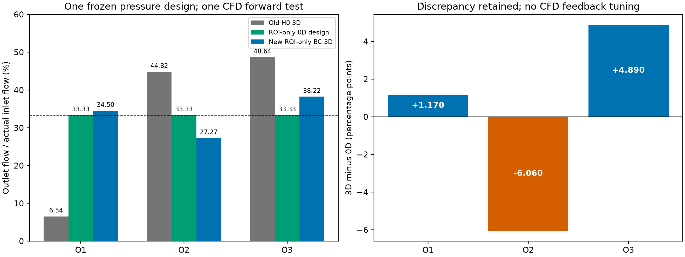
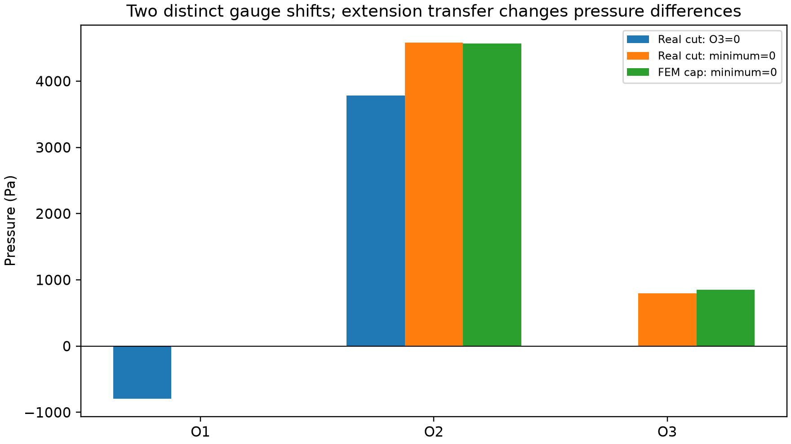

# ROI-only 直接压力边界设计与唯一 3D 前向验证

## 通俗结论

本轮只保留固定 ROI 内部几何，直接设计出口间压差。混合边界回归通过，0D 三出口均分达到浮点精度；所需 O1−O3 = -795.609843550 Pa，原 full-A 被动下游模型不允许这一压差，新模型允许。新压力冻结后只进行一次 GPU CFD，独立验收通过。实际 3D 三出口为 34.50368% / 27.27289% / 38.22343%，结论为 **ROI_ONLY_BALANCE_IMPROVED_IN_3D**。0D 均分没有被冒充为 3D 均分；保留二者差异，不进行反馈调压。这些是数值设计边界，不是实测生理压力。旧 full-A 不可达证明未改写；Particle/RBC 调用为 0。

## 1. 版本和并列模型

- 实际起点 `69c6af94eabb87ba6db0823134c4b92b30a069db`；历史基线 `f43c09b1e55cbd9702a65c600a464154fcf346f3`，没有回退。
- 分支 `sync/current-h0-dt1ms-wss-audit-20260927`，工作树 `/home/lzy/projects/temp_storage/github_sync_20260927`。本次新增代码及结果位于独立 ROI-only 路径。
- MODEL A：FULL-A DOWNSTREAM-CONSTRAINED，固定 ROI、正下游阻力、共同 distal reference 下等分不可达，证书原样保留。
- MODEL B：`ROI_ONLY_PRESSURE_BOUNDARY_0D_V1`；`workflow_kind=ROI_BOUNDARY_DESIGN`。full-A downstream 是否参与新边界生成：**NO**。full-A 仅为已验证 ROI 几何来源。
- 保留检查覆盖原有已跟踪网络代码与报告 232 个文件，逐字节 SHA256 全部相同；见 `previous_work_preservation.json`。新模型没有半径设计变量，也没有 source node 2410、外部叶子或终端树参与求解。

## 2. ROI 定义、单位和端口

从 `analysis_A_H0_graph_si.npz` 的 `roi_internal_edge_mask` 取边及其端点，得到 **109 节点 / 108 边**的连通树，四个一度叶节点恰为已验证的四个端口。缓存 `roi_geometry_cache.npz` 包含节点 ID、SI 坐标、原半径、源图节点/边索引、本地连接、长度、阻力及端口系数；其中 source_node_indices 指输入文件索引，不是水力源。

| 端口 | 网络节点 ID | 坐标 μm | 源图边索引 | 流量系数/正方向 |
| --- | --- | --- | --- | --- |
| INLET | -10001 | 103.266599, 46.999184, 147.180000 | 815 | 1 / INTO_ROI |
| O1 | -10002 | 113.417436, 122.040000, 100.410256 | 898 | 1 / OUT_OF_ROI |
| O2 | -10003 | 90.040000, 48.091273, 110.910909 | 1977 | 1 / OUT_OF_ROI |
| O3 | 4484 | 164.010000, 96.360000, 82.780000 | 2076 | 1 / OUT_OF_ROI |

端口身份来自 `roi_ports_in_a.json`，与已保存符号约定逐项回归；INLET 正方向为流入 ROI，O1/O2/O3 正方向为流出。edge u→v 只是代数存储方向，反转存储测试通过，不用 abs(Q) 隐藏倒流。

长度 m、半径 m、时间 s、Q m³/s、压力 Pa、动力黏度 Pa·s、阻力 Pa·s/m³。实际 `mu=0.00345312` Pa·s，`Qin=1.551359160440232e-14` m³/s。FEM rho=1056 kg/m³，nu=mu/rho=3.27e-6 m²/s。ROI 缓存 SHA256 `9d8897785bedd8595ecc0fdf2b1d60d3608bf4eda157a3d5f65c5d962f6c8e58`（覆盖几何、索引、端口系数及固定 mu 下的长度/阻力数组；不是仅坐标散列）；几何原文件 SHA256 `11cd4d191d00e194081721dddf7ff9c35b37e2245404d0f46e65bfc37de80740`。

## 3. 实际代码和混合边界方程

新增 `network_1d0d/roi_only_hydraulics.py::load_roi_cache/solve_roi_mixed_bc` 和 `roi_boundary_design.py::regress_h0/pressure_basis/design`，入口为 `scripts/optimize_roi_boundary_balance.py`。局部阻力只调用权威 `hydraulic_resistance.py::linear_radius_resistance`：

```text
R_e = (8*mu*L/pi)*(r0²+r0*r1+r1²)/(3*r0³*r1³)
g_e = 1/R_e
G = assembled ROI graph Laplacian
G_ff P_f = q_f - G_fb P_b
q_INLET = +Qin; all interior q = 0
P_b = [P_O1, P_O2, P_O3]
Q_e = (P_u-P_v)/R_e
Q_port = port_coefficient * Q_port_edge
```

INLET 在自由压力未知量中，三个出口为固定压力节点。代码用统一数值缩放 `G/max(g)` 改善线性系统量级，**不做 source=1 Pa 后再缩放流量的 operating-point solve**。四个端口流量从完整 ROI 网络解提取，不用简化总阻力公式替代网络。

## 4. 必须先通过的 H0 回归

使用正式 H0 0D 提取的相同 real-cut 三出口压力和 Qin；未调用 full-A optimizer，也未读取 CFD 场来设计压力。最大端口 Q 差 / Qin = `1.74922840768e-14`，门槛 1e-9，**PASS**。此检查在 basis 与优化之前执行。重构入口压力也一致，但未把它当额外强制入口条件。

| 端口 | H0 提取压力 Pa | 重构压力 Pa | H0 提取 Q m³/s | 重构 Q m³/s |
| --- | --- | --- | --- | --- |
| INLET | 4364.7484131795 | 4364.7484131795 | 1.5513591604402e-14 | 1.5513591604402e-14 |
| O1 | 342.34140100578 | 342.34140100578 | 9.7771762519491e-16 | 9.7771762519483e-16 |
| O2 | 3065.6079992276 | 3065.6079992276 | 7.6931915504975e-15 | 7.6931915504978e-15 |
| O3 | 0 | 0 | 6.8426824287099e-15 | 6.8426824287097e-15 |

重构 O1/O2/O3 fraction = `[0.06302329274398236, 0.4959000950053815, 0.4410766122506353]`；完整节点压力和边流量保存在 `roi_mixed_bc_regression.json`。

## 5. 线性 basis 与独立迭代交叉检查

变量 `[dP_O1_O3, dP_O2_O3]`，P_O3=0。三次实际 mixed solves 分别为 (0,0)、(1 Pa,0)、(0,1 Pa)：

```text
q_out = q0 + B @ dP
q0 [m³/s] = [1.1302084287941015e-16, 1.50805876590432e-14, 3.1998310247976223e-16]
B [m³/(s·Pa)] =
[[-3.275739667585371e-18  6.478708595318078e-19]
 [ 6.478708595224400e-19 -2.482114193394859e-18]
 [ 2.627868808053107e-18  1.834243333863347e-18]]
```

B rank = 2，2-norm condition = 1.36267879897，奇异值 `[4.266120027034399e-18, 3.130686431949062e-18]`。直接用 `numpy.linalg.lstsq(B, Qin/3-q0)` 求解；另外从 H0 `[342.3414010057839, 3065.6079992276077]` Pa 出发，以实际网络分流残差执行无界 `scipy.optimize.least_squares`，三点 Jacobian、ftol/xtol=1e-13、gtol=1e-14、x_scale=1000 Pa。负相对压差允许。

- direct dP Pa：`[-795.6098435498533, 3784.6518300349617]`。
- iterative dP Pa：`[-795.60984354951, 3784.6518300329462]`。
- direct−iterative Pa：`[-3.433342499192804e-10, 2.015440259128809e-09]`；严格差异门槛 1e-6 Pa，PASS。
- nfev=3；含有限差分实际网络评价 15 次，完整 trace 在 CSV。终止原因 ``gtol` termination condition is satisfied.`。
- equal-split 状态 **ROI_EQUAL_SPLIT_REACHED**；最大等分偏差 `3.26183524635e-13` < 1e-8；极差 `5.17530462929e-13`，std `2.37598548239e-13`，J `1.69626375378e-25`。
- 内部节点最大相对残差 `5.20700549264e-14`，ROI 质量残差 `2.50180342029e-14`，PASS。

固定路径独立提取：J2 节点 3274，R(J2→O1)=2.378728826416807e+17、R(J2→O3)=8.401879188610662e+16 Pa·s/m³；与旧证书严格回归。等分恒等式 `(R3-R1)*Qin/3` = -795.609843549542 Pa，与直接解差 -3.1127456e-10 Pa；与题给四舍五入参考 -795.60984355 Pa 一致。旧被动模型不允许 P1<P3；新设计允许，二者没有逻辑冲突。

## 6. 两次 gauge 与延伸段 handoff

第一次共同加 `795.609843549853` Pa，把最小 real-cut outlet 压力设为零；入口从 `5055.43252976595` 变为 `5851.0423733158` Pa。全体节点统一平移验证通过，Q 改变量 / Qin 最大 `1.57125458713e-14`。该操作只换参考零点，不改变压差。

冻结文件 `roi_boundary_design_frozen.yaml`，SHA256 `438f6cf3121a9b73b5accacc3a5a8074456b44b149e23aa4e3ef1f18d009cf60`。它是 handoff 的唯一压力来源，不是 full-A frozen 参数文件。文件有内容校验和、禁止覆盖，正式求解器启动前已冻结。

复用实际 FEM extension geometry 截面方法：沿各延伸段取 40 个中点截面，用闭合面积换算等效圆半径；相邻半径间调用同一个解析渐变半径积分，两端半格按端部半径闭合。显式 mu=0.00345312 Pa·s。这是圆截面充分发展阻力近似，不包含真实 3D 分叉损失。

```text
P_cap_raw_i = P_realcut_gauge_i - R_ext_i*Q_i
P_cap_applied_i = P_cap_raw_i - min(P_cap_raw)
```

第二次统一加 `278.348336676419` Pa，只对完成延伸段压降转移后的 cap 参考做平移。它与第一次 real-cut gauge 分别记录，不能把 R_ext*Q 压降误称为 gauge。raw cap 的负值不裁剪。

| 端口 | 相对 real-cut Pa | 平移后 real-cut Pa | 0D Q m³/s | R_ext Pa·s/m³ | raw cap Pa | applied cap Pa |
| --- | --- | --- | --- | --- | --- | --- |
| O1 | -795.60984354985 | 0 | 5.17119720147e-15 | 5.382667220606e+16 | -278.34833667642 | 0 |
| O2 | 3784.651830035 | 4580.2616735848 | 5.1711972014624e-15 | 5.5785046259137e+16 | 4291.7861984861 | 4570.1345351625 |
| O3 | 0 | 795.60984354985 | 5.1711972014704e-15 | 4.3195387401783e+16 | 572.23797710132 | 850.58631377774 |

## 7. 唯一科学 CFD 的受控配置与资源

本地算例：`/home/lzy/projects/temp_storage/github_sync_20260927/ulm_flow_mean_2p0_mmps/formal_3D_flow_solver/FEM_SimVascular/flow_cases/mean-2p0-mmps-A-ROI-only-balanced-pressure-v1`。

服务器：`vast4090`（root@50.115.148.16:4159），算例 `/workspace/flow_roi_only_balance_20260928/mean-2p0-mmps-A-ROI-only-balanced-pressure-v1`；独立 supervisor `roi_balance_gpu`，autorestart=false。原 H0 本地 `/home/lzy/projects/temp_storage/github_sync_20260927/ulm_flow_mean_2p0_mmps/formal_3D_flow_solver/FEM_SimVascular/flow_cases/mean-2p0-mmps-A-H0-pressure-v1`。

`prepare_roi_balance_fem.py` 复用 `serialize_fixed_pressure_xml()` 和 `audit_xml_change()`，预检后创建此唯一算例。XML 仅三个 outlet traction Value 改变；网格、WALL、入口、材料参数、P1/P1+VMS、policy 与 PETSc options 逐字节不变。XML 中入口 Value 为负是外法向通量约定，实际正 Qin 经表面积分核查。配置差异明细在 `configuration_diff.json`。

生产 Qin `1.551359160885543e-14` m³/s 原样保留；它和 0D 目标的相对差约 2.87e-10，没有写回改入口。刚性不可压缩牛顿流体、无滑移壁面，70363 节点 / 371402 四面体。dt `1.504060091688221e-07` s，每 10 步采样；连续 5 个间隔 E_u≤1e-05、E_Q≤1e-06，入口/整体质量残差≤1e-06。线性 KSP rtol=1e-10、atol=1e-24；非线性每步至少 2 次，最终残差比≤1e-10。最大 800 步 / 14400 s 原预算未放宽。

MPI=1、OMP=1，保持原已验证 PETSc CUDA 配置；GMRES(100)、右预条件 ASM overlap=2、子域 ILU(2)、aijcusparse/cuda。CPU 做 FEM 装配及部分预条件器构造，GPU 做实际稀疏线性运算。没有为了占满 CPU 核数改 MPI 分解或重做后端试验。0D 仅 109 节点，CPU 求解；把它搬到 GPU 无助于本次大头 CFD。

GPU 实际采样 323 次，峰值利用率 98%，采样平均 67.58%，显存峰值 3840 MiB。实际 profile 而非只凭显存占用判断 GPU 工作（事件行末列为 GPU %F，表示该事件浮点工作在 GPU 的比例，不是总 CFD 时间比例）：

```text
Using PETSc Release Version 3.25.5, Aug 30, 2026
MatMult           166811 1.0 4.2031e+01 1.0 5.29e+12 1.0 0.0e+00 0.0e+00 0.0e+00  3 14  0  0  0   3 14  0  0  0 125832   148517    159 2.04e+04    0 0.00e+00 100
MatLUFactorNum        15 1.0 8.6270e+01 1.0 2.01e+11 1.0 0.0e+00 0.0e+00 0.0e+00  5  1  0  0  0   7  1  0  0  0  2334       0      0 0.00e+00    0 0.00e+00  0
KSPSolve             159 1.0 1.1586e+03 1.0 3.88e+13 1.0 0.0e+00 0.0e+00 0.0e+00 71 99  0  0  0  92 99  0  0  0 33492   34804   166385 2.12e+04 82210 3.90e+02 100
PCSetUpOnBlocks      159 1.0 9.3033e+01 1.0 2.01e+11 1.0 0.0e+00 0.0e+00 0.0e+00  6  1  0  0  0   7  1  0  0  0  2164       0      0 0.00e+00    0 0.00e+00  0
PCApply           165908 1.0 1.0457e+03 1.0 2.65e+13 1.0 0.0e+00 0.0e+00 0.0e+00 64 68  0  0  0  83 68  0  0  0 25311   25515      0 0.00e+00    0 0.00e+00 100
```

**NEW SCIENTIFIC CFD RUN COUNT = 1**；单次 dispatch 由 O_EXCL 排他登记、重复启动拒绝。求解器实际退出码 0，wall time 1633.077395 s（27.218 min）。原停止判据在 step 70 满足，安全退出最终 native step 71，物理时间 1.0678826651e-05 s。从零场启动，无缩放旧场或 warm start。

## 8. 独立日志、场与稳态验收

`validate_roi_balance_fem.py` 继承原验收链路，重新解析完整 solver.log，逐步 PETSc reason / 真实线性残差与非线性最终残差检查；重新读取全部保存的采样 VTU，独立计算连续稳态区间。独立合格步 `[70]`，总体 **PASS**。检查最终 VTU 坐标/四面体与输入一致，并核对 checkpoint 步号/时间及哈希。仅残差变小或图像平滑不作为科学正确性的证明。

- 实际入口 Q `1.551359160440232e-14` m³/s；入口误差 `2.87045737436e-10`。
- 整体质量残差 `0`，补偿求和 `5.08496629994e-17`。
- 壁面无滑移 `True`，速度/压力全部有限；最大速度 `0.00706304594875` m/s，压力范围 `[-1.0179652708523008, 6445.54752270147]` Pa。
- 最终场对合格停止场速度相对 L2 差 `5.26462596077e-15`，归一化流量差 `2.03398651998e-16`，通过原门槛。
- 所有出口净流量为正；未据此宣称每个面片没有局部回流。

## 9. 实际 3D 分流与旧 H0 比较

所有比例是带符号 Qout/实际 Qin，不裁剪、不再次强行归一化；旧 H0 3D 从正式 frozen VTU 重新积分，不用旧 0D 数字替代。cap 面积平均流体压力是输出场测量，区别于施加的法向牵引压力。

| 端口 | 实际 3D Q m³/s | Qout/Qin % | 3D−0D 百分点 | cap 面积均压 Pa |
| --- | --- | --- | --- | --- |
| O1 | 5.35276072196612e-15 | 34.50368463 | +1.17035130 | 7.89260592481 |
| O2 | 4.23100481169497e-15 | 27.27289025 | -6.06044309 | 4577.01148429 |
| O3 | 5.92982607074122e-15 | 38.22342512 | +4.89009179 | 857.610950374 |

| 模型/算例 | O1 % | O2 % | O3 % | 极差（比例） | 总体 std | 最大等分偏差 |
| --- | --- | --- | --- | --- | --- | --- |
| 旧 H0 3D | 6.54082456 | 44.82012154 | 48.63905390 | 0.420982293383 | 0.190092075208 | 0.267925087731 |
| ROI-only 0D | 33.33333333 | 33.33333333 | 33.33333333 | 5.17530462929e-13 | 2.37598548239e-13 | 3.26183524635e-13 |
| 新 ROI-only BC 3D | 34.50368463 | 27.27289025 | 38.22342512 | 0.109505348753 | 0.0454648913132 | 0.0606044308596 |

按预先规定 `new range < old range`，得到 **ROI_ONLY_BALANCE_IMPROVED_IN_3D**。极差减少 `0.311476944631`，std 减少 `0.144627183895`；正值表示改善。0D→3D 差异 `[0.01170351296630956, -0.060604430859235, 0.04890091789289708]` 保留，不把差异当作重新调压依据，也不要求三出口 3D 各等于 1/3 才能验收。





新冻结流场 `/home/lzy/projects/temp_storage/github_sync_20260927/ulm_flow_mean_2p0_mmps/formal_3D_flow_solver/FEM_SimVascular/flow_cases/mean-2p0-mmps-A-ROI-only-balanced-pressure-v1/frozen_flow/steady_flow_mean_2p0_mmps_A_ROI_only_balanced_pressure.vtu`，SHA256 `fb3c6ad0815d156b09b289fc347766486f24ddb521b8e51e8bbc4cf1fd2ace12`；SI arrays 和 manifest 在同一 frozen_flow 目录。**CFD-based retuning = NO；Particle/RBC calls = 0；没有生产微泡/RBC 晋升。**

## 10. 实际测试、命令及独立复核

```bash
cd /home/lzy/projects/temp_storage/github_sync_20260927
PYTHONDONTWRITEBYTECODE=1 OPENBLAS_NUM_THREADS=1 PYTHONPATH=ulm_3D_vascular \
/home/lzy/projects/formal_3D_flow_solver/FEM_SimVascular/.venv/bin/python -B -m pytest \
ulm_3D_vascular/tests/network_parameterized ulm_3D_vascular/tests/network_1d0d \
ulm_3D_vascular/tests/network_h0 ulm_3D_vascular/tests/network_roi_only -q -p no:cacheprovider
```

正式启动前实际结果 **155 passed in 9.85s**。旧 full-A 不可达性测试保留且通过；新 ROI 17 项包括限定内部几何、四端口、质量、H0 回归、gauge、affine basis、direct/iterative 一致性、负压差恒等式、无下游/CFD 依赖、半径不可变、冻结篡改/覆盖拒绝、仅三个 XML 压力改动、边反转及真实倒流符号。

按执行顺序保存命令在 `REPRODUCE.md`；审核者可在新审计目录重算纯 0D 和只读 3D 验收。**不要再次启动 CFD**，现有 dispatch 文件使启动器拒绝重复执行。报告生成器仅读取完成的独立验证记录，不会启动求解器。

核心来源与代码副本在 `evidence/`，原始取样和求解日志在 case `run/`，独立验收在 `independent_validation.json`。必要汇总 `boundary_and_flow_summary.csv`、`balance_comparison.csv`、`final_3D_ports.csv`、`roi_iteration_trace.csv`、`roi_fem_cap_pressures.csv`；机器可读数值保留完整精度。

## 11. 未验证的科学部分和结论边界

1. ROI-only pressure 是自由数值设计，不是全网预测或实测压力；人工移除下游被动约束，不能宣称得到可生理实现的全脑网络。
2. 0D 解析阻力假设圆截面、充分发展、刚性牛顿流，3D 有真实分叉及非圆几何；延伸段阻力补偿也仅为近似。当前差异符合模型层级不同的可能性，但没有把单次比较当作原因分离证明。
3. 只进行单张原生产网格上的一次受控压力改变，无新网格独立性、时间步独立性或边界敏感性扫描；不能据此量化真实血管离散误差。
4. 3D 实际输出与稳态门槛通过支持“这个固定算例的前向计算与分流比较”；并不等同于生理真值、WSS 局部精度或实验校准通过。
5. 原 full-A study、旧不可达证明和旧正式流场全部保留；两种模型回答不同问题。本轮没有压力反馈迭代，没有新增轨迹计算。

## 12. 需求交付索引

| 原要求 | 证据位置 |
| --- | --- |
| 1–4 起点、模型、节点/边数、无下游 | 第 1–2 节；cache summary |
| 5–6 H0 mixed 回归 P/Q/fraction | 第 4 节；regression JSON |
| 7–11 B/rank/条件数/direct/iterative/差值 | 第 5 节；basis 与 solution JSON |
| 12–17 相对/gauge 压力、Q/fraction/指标/−795.61 恒等式 | 第 5–6 节；frozen YAML |
| 18–20 R_ext/raw/applied cap | 第 6 节；handoff JSON 与 CSV |
| 21–22 唯一算例和实际 CFD 次数 | 第 7 节；dispatch/completion 原记录 |
| 23–26 实际 3D/0D/H0 比较 | 第 8–9 节；independent validation 与 CSV |
| 27–28 无反馈、Particle/RBC=0 | 第 9 节；dispatch 及 manifest |
| 29 pytest 命令和通过数 | 第 10 节；pytest.log |
| 30 科学限制 | 第 11 节 |
