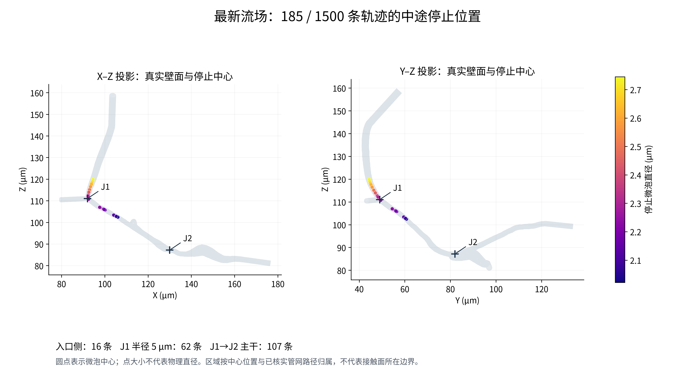
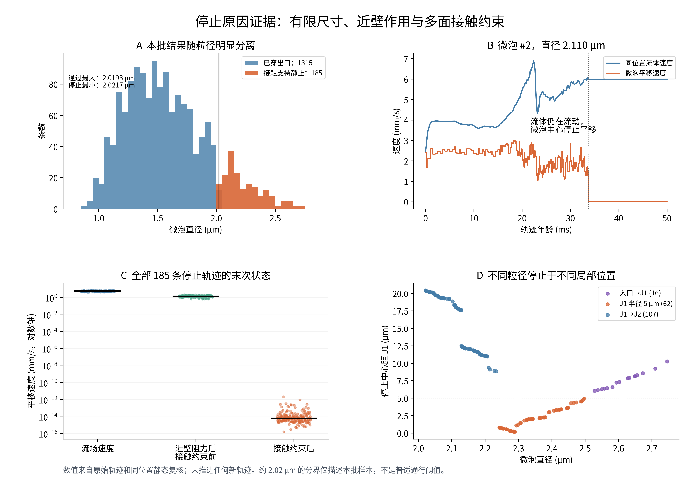

# 最新流场微泡轨迹中途停止原因分析

检查日期：2026-09-28。对象：ROI-only-balanced-pressure-v1，1500 条独立微泡轨迹，名义 dt=0.5 ms。

本次仅读取原始流场、轨迹和审计记录，并复算终端位置的静态阻力/接触方程；未启动 CFD，未推进新轨迹，未修改模型、入口粒径分布、原始结果或动画。所有新文件集中于本目录。

## 1. 通俗结论

这批轨迹中有 **185/1500（12.33%）条被标记为接触支持静止**，其余 1315 条穿过出口。停止处的流体仍以 **4.57–6.92 mm/s** 流动；微泡则被当前“固定半径球体＋近壁阻力＋多壁面不穿透约束”限制，中心平移速度降到浮点误差量级，随后由停滞保护结束积分。它们集中在入口至 J1 和 J1→J2 主干，且均属于本批较大粒径。

动画会继续显示已停止轨迹的最后一个位置，因此画面中的静止时长超过实际计算时长。另有部分成功出流的轨迹只是投影位移很小，原始坐标并未停住。

这证明了**现有模型内的停止机制及显示机制**，没有证明真实微泡会永久卡在这些位置；多面接触、局部平面近壁模型、球体不变形和单向流固耦合的适用性仍有限制。

## 2. 对象、数据版本与实际流程

原始批次目录：

`/home/lzy/projects/ulm_particle_formal_p9a5/particle_3d/reports/microbubble_roi_only_dt0p5ms_n1500`

流场源文件：

`/home/lzy/projects/formal_3D_flow_solver/FEM_SimVascular/rotate_visualization/roi_only_balance_v1/input_data/frozen_flow/steady_flow_mean_2p0_mmps.vtu`

流场 SHA256：`fb3c6ad0815d156b09b289fc347766486f24ddb521b8e51e8bbc4cf1fd2ace12`。

实际流程为：新流场 FEM 节点速度/压力 → 四面体内插值 → 每个微泡位置的流体速度及半涡量 → 球体自身阻力、近壁阻力及局部平面剪切修正 → 多壁面不穿透约束 → 自适应子步推进 → 出口或保护终止 → 逐轨迹审计分类 → 动画插值。

| 项目 | 本批实际值或方法 |
|---|---|
| 动力黏度 | 0.00345312 Pa·s，`scripts/campaign.py:51` 显式核对 |
| 名义 dt | 0.0005 s；允许细分子步，不能把每个保存状态都当作 0.5 ms |
| 最大轨迹年龄 | 调度允许 3/6/12 s；本批全部使用初始 3 s 档，未发生延长 |
| 粒径来源 | 原有 `SONOVUE_D_LE_4UM_CONDITIONAL`，按源顺序接受，未按出口结果筛选 |
| 微泡模型 | 固定半径球体，6 个瞬时运动分量（3 平移＋3 转动） |
| 耦合 | 独立单微泡、单向读取冻结流场；无微泡互撞、无 RBC 相互作用 |
| 流场/几何一致性 | 当前 VTU 点、速度、压力与批次 `gpu_mesh_input.npz` 逐元素相同；45221 个壁面三角形坐标与顺序相同 |
| 完整性 | 9000 个轨迹原始文件哈希、114 个受保护源码哈希核对通过；185 个完整审计流的最后 32 次接受解与 support.json 一致 |

`frozen_reference` 未作为本次生产速度使用。区域划分仅复用已核实管网的几何路径，不导入旧流场。完整来源及哈希见 `data/source_hashes.json`。

## 3. 停了多少、在哪里、哪些微泡停止

| 终态 | 条数 | 占全部轨迹 |
|---|---:|---:|
| 穿过 O1 | 787 | 52.47% |
| 穿过 O2 | 61 | 4.07% |
| 穿过 O3 | 467 | 31.13% |
| 接触支持静止 | 185 | 12.33% |

这里的出口完成表示**中心穿过官方出口三角形**，不是已证明整个有限尺寸球体完全离开。微泡出口比例也不能替代 CFD 体积流量比例。

| 停止中心区域 | 数量 | 停止微泡直径范围（μm） |
|---|---:|---:|
| J1_to_J2 | 107 | 2.021714–2.233957 |
| J1_r5um | 62 | 2.242739–2.497116 |
| INLET_to_J1 | 16 | 2.527862–2.745384 |

J1=(92,49,111) μm，J2=(130.04,82.04,87.18) μm。先以欧氏距离小于 5 μm 分配 J1/J2 球形统计区，其余按已保存管网折线路径的最近距离归属；这是中心位置分区，不是严格的血管壁解剖分割。没有停止中心归属 J2 或其下游出口支路。

成功出流的直径范围为 **0.8782–2.0193 μm**；停止的范围为 **2.0217–2.7454 μm**。本批约 2.02 μm 附近存在清楚的结果分离，但没有对同一出生位置逐个改变粒径，**不能把它当作普适临界直径**。入口允许进入，也不保证之后每一处弯曲/收缩都允许固定大小球体通过。



图 1 使用真实壁面三角形的两个正交投影；微泡标记代表中心，颜色表示真实直径，标记大小不表示半径。

## 4. 为什么流体在动，微泡却停了

当前微泡不是没有尺寸的流线示踪点。先根据流体和近壁条件求它“尚未施加不穿透约束时”的运动：

\[
R\,U_{\mathrm{hydro}}=b,\qquad U=(\mathbf v,\boldsymbol\omega).
\]

其中 \(R\) 是包括近壁修正的阻力矩阵，\(b\) 是流场与局部剪切产生的等效驱动。再找一个满足各个接触面约束、且对原有运动改动最小的解：

\[
\min_U\frac12 U^TRU-b^TU,\qquad JU\ge 0.
\]

对静止壁面和球体，每条约束是 \(\mathbf n_k\cdot\mathbf v\ge0\)，法向指向允许的流体侧。单面接触不自动把全部速度设零；切向仍可运动。多个不同朝向的壁面同时限制运动时，在当前驱动下最优平移速度可能为零。球体接触的转动 Jacobian 为零，故“中心停住”也不意味着转动为零。

本批停止位置同时有 **3–6 条**接触约束，独立平移约束秩为 3。每个微泡接触法向的最大夹角为 **143.0°–178.9°**，说明约束来自方向差异很大的面/边，而非只有一组近乎平行的重复法向。

所有停止微泡均处在模型规定的连续介质交接间隙：

\[
h_{\mathrm{lower}}=\max(2\times10^{-9}\ \mathrm m,\ 10^{-3}a),
\qquad h_{\mathrm{geom}}=\operatorname{dist}(\mathbf x,\text{有限壁面三角形})-a.
\]

这里 \(a\) 为球半径；本批停止粒径对应的有效下限均为 **2 nm**。这个下限是模型的交接尺度，**不是实测气泡壳层厚度或黏附力**。在此尺度施加不穿透约束，且没有把中心位置投影或强行移动到别处。

下表由全部 185 个终端位置重建原始阻力和接触方程得到，单位均为 mm/s：

| 速度阶段 | 最小值 | 中位数 | 最大值 |
|---|---:|---:|---:|
| 同位置流体速度 | 4.57164 | 5.95657 | 6.91634 |
| 近壁阻力修正后、接触约束前 | 0.697966 | 1.46024 | 2.20862 |
| 接触约束后平移速度 | 1.6263e-16 | 6.55292e-15 | 2.12437e-12 |

因此，近壁阻力使微泡减速，而**最终将其平移降至近零的是本次重建的多面接触约束解**。末次转动速率仍为 9.37–1262.49 s⁻¹；球形标记没有可见朝向，动画看不出自转。

必须保留两个限制：

1. 瞬时线性可行性检查中，182 个位置没有朝局部流体速度方向正向前进的可行速度；3 个位置（433、762、950）仍有这种方向，不能把全部 185 个都简单解释为“几何上向前无路”。对这 3 个位置进一步消去自由转动，按实际阻力矩阵的有效驱动方向检查，仍得到支持静止的解；它们由**实际近壁驱动与约束共同作用**解释。补充数值见 `three_forward_exceptions.csv`。
2. **全部 185 个位置都仍存在某种非零的瞬时可行逃离/后退方向**。约束秩为 3 不代表所有方向都被永久封死。当前驱动选择静止，与“任何外力下都无法移动”是不同命题。

3 个补充位置的驱动—约束平衡残差为 1.35×10⁻²⁴–4.63×10⁻²⁴ N（代数等效量），不是实测接触力。源码将乘子标为运动学约束乘子，并明确不作物理接触力声明。



图 2B 的流体速度是在各个微泡中心采样；保存的微泡速度作用于前一个接受时间区间，因此采用相应阶梯画法。图 2C 为末次位置的静态复算，不是重新积分。

## 5. 程序何时结束轨迹；为什么动画一直停在那里

有 **165 条**触发“连续 32 个名义步坐标完全相同”。在 dt=0.5 ms 下，该保护观察窗口对应 16 ms；它没有规定一个物理捕获时间。

另 **20 条**触发“最近 64 个已接受子步的位置变化落在舍入预算内”。实际空间预算为 `3.21505834e-16 m`，代码每 128 次 provider 调用检查一次。64 个接受子步不一定等于 64 个名义步，也不能直接写成 32 ms。

保护异常被正常捕获，底层 `end_reason` 为 `INTEGRATION_SAFETY_STOP`。后续只有最后 32 个接受解同时满足“约束秩 3、平移低于本解 KKT 数值预算、乘子非负”，才分类为 `SUPPORTED_STATIONARY`；其余不应误报支持静止。此处185条的窗口均已从原始压缩日志重新读取核对。

这些轨迹在年龄 **40.5–105 ms** 终止，远早于初始 3 s 上限。没有 `LONG_RESIDENCE_CENSORED`。延长总模拟时长不能直接解决这种提前触发的保护。

例如微泡 **#2**：直径 **2.109788 μm**，终点 **(104.546064, 59.790383, 103.165023) μm**，位于 J1→J2。约 **33.721 ms** 起平移近零，**50.0 ms** 结束。该处流体速度仍为 **5.970458 mm/s**。参与约束的原壁面三角形为 **10308 FACE、17438 FACE、27551 EDGE、27552 EDGE**，去除冗余后秩为 3。三角形编号是当前 `WALL.vtp` 的零起始面片序号。

动画入口 `scripts/render_results.py:172–173`：

```python
if age > s[-1, 0] and rows[i]['status'] == 'COMPLETED':
    xyz.append([np.nan] * 3)
else:
    xyz.append([np.interp(age, s[:, 0], s[:, j]) * 1e6
                for j in (1, 2, 3)])
```

出流轨迹到终点后隐藏；静止轨迹则被 `np.interp` 保持在末坐标。主动画的 12 s 视频表示 0–146.029 ms 的轨迹年龄，185 个终点额外保持约 **3.37–8.67 s 视频时间**。这部分是显示延续，没有模拟更长的物理滞留。另 3 个视角采用同一逻辑。轨迹按年龄对齐，不能将画面理解为全部微泡同时注入。

针对“看起来暂停但后来又继续”的另一类情况：1315 条成功出流轨迹均无原始坐标的完全静止平台；用位移/时间速度 ≤10⁻⁹ m/s 的诊断阈值也未检出非零时长平台。但主相机投影下，有 **759 条**存在至少 3 个连续帧间隔、每个间隔移动 <0.5 像素的片段，最长 **1.50 s 视频时间**。这是特定相机和阈值下的显示诊断，并非原求解器的停滞判据。记录见 `apparent_pauses.csv`。

## 6. 关键源码与已执行检查

| 环节 | 源码 | 实际行为 |
|---|---|---|
| 固定半径球体 | [particle_shapes.py:27](/home/lzy/projects/ulm_particle_formal_p9a5/particle_3d/src/particle_3d/particle_shapes.py:27) | moved() 只改变中心，不改变半径 |
| 阻力矩阵与近壁项 | [particle65_motion.py:25](/home/lzy/projects/ulm_particle_formal_p9a5/particle_3d/src/particle_3d/particle65_motion.py:25) | assemble_v1；由 free 速度和阻力装配 |
| 局部平面修正 | [particle9a_motion.py:30](/home/lzy/projects/ulm_particle_formal_p9a5/particle_3d/src/particle_3d/particle9a_motion.py:30) | augment_planar_system；nearest single planar wall |
| 接触间隙 | [nearfield_regularization.py:37](/home/lzy/projects/ulm_particle_formal_p9a5/particle_3d/src/particle_3d/nearfield_regularization.py:37) | max(2 nm, 0.001 a) |
| 真实有限面片约束 | [nearfield_handoff.py:54](/home/lzy/projects/ulm_particle_formal_p9a5/particle_3d/src/particle_3d/nearfield_handoff.py:54) | 有限三角形的 FACE / EDGE 距离及法向 |
| 约束阻力求解 | [resistance_solver.py:43](/home/lzy/projects/ulm_particle_formal_p9a5/particle_3d/src/particle_3d/resistance_solver.py:43) | 先 hydro，再接触乘子修正；不是触壁就直接置零 |
| 坐标停滞保护 | [particle82a_integration.py:64](/home/lzy/projects/ulm_particle_formal_p9a5/particle_3d/src/particle_3d/particle82a_integration.py:64) | 64 接受子步舍入检查；90 行为32名义步检查 |
| 支持静止审计 | [formal_dynamics_p9a5.py:68](/home/lzy/projects/ulm_particle_formal_p9a5/particle_3d/src/particle_3d/formal_dynamics_p9a5.py:68) | 最后32个接受解的秩、速度及乘子 |

当前批次入口为 `/home/lzy/projects/ulm_particle_formal_p9a5/particle_3d/reports/microbubble_roi_only_dt0p5ms_n1500/scripts/campaign.py`，dt、流场身份与黏度在此绑定。不能用历史模块文件顶端的默认 dt/HORIZON 代替当前实际生效配置。

| 已执行检查 | 数量/范围 | 结果及限制 |
|---|---|---|
| 原始文件和源码身份检查 | 9000 个轨迹文件、114 个受保护源码 | 哈希吻合；不代表科学模型已充分验证 |
| 原始保存点检查 | 1500 条 | 坐标/速度有限、时间递增、接受步长≤0.5 ms；原审计报告的穿透、交接违反、入口逃逸、NaN/Inf、未分类损坏均为0 |
| 重新读取完整终端审计 | 185 条压缩日志 | 最后32次接受解与 support.json 相同，全部满足支持静止条件；未重演每个历史试探步 |
| 原生产方程静态复算 | 全185个末次接受位置 | 接触ID完全相同；平移分量最大差 `5.419e-16 m/s`；约束前速度最大差 `3.101e-17 m/s` |
| 近壁几何检查 | 185个位置，真实有限面片 | 最小几何间隙均在2nm附近并满足原舍入预算；没有修改壁面或球半径 |
| 瞬时方向可行性 | 185个位置 | 182无流体速度方向正进，3例外；全部有某种非零可行方向，不能证明永久封闭 |
| 有效驱动补充检查 | 433、762、950，再做3次静态复算 | 对实际驱动无正功可行方向，支持现有静止解；无新轨迹 |
| 动画端点规则和投影诊断 | 主动画、3个附加视角共享规则 | 185终点被保持；成功出流者可有短暂亚像素投影运动 |
| 网格、dt、半径、交接间隙或近壁模型敏感性 | 本次未运行 | 不把上述一致性核对当作这些敏感性验证 |

静态矩阵的自对角缩放后条件估计为 506.4–687.3，相对后向残差为 1.83×10⁻¹⁸–1.30×10⁻¹⁶。它们没有触发原求解器病态或残差拒绝标准，但不能据此证明连续物理模型正确。

脚本中的 `all_pass` 仅表示其列出的断言通过，**不表示所有中途停止均是真实生理捕获**。

## 7. 原因判断、限制与处理建议

| 候选原因 | 本次判断 | 依据与限制 |
|---|---|---|
| 固定大小球体在局部几何中受多面约束 | 当前实现内有直接证据 | 较大粒径集中停止、2nm交接间隙、3–6约束、静态原方程复现；尚非真实微泡捕获证明 |
| 流场局部速度为0 | 与这185个停止位置的数据不符 | 同位置流速仍为4.57–6.92mm/s |
| 积分时长不足 | 不是这些终态的直接原因 | 40.5–105ms被保护终止，未触及3s上限 |
| 程序崩溃、NaN或数据损坏 | 本批未发现相应证据 | 状态、原始文件完整性及静态复核一致；安全保护异常被正常处理 |
| 压力边界配置错误 | 本次不能据停滞判定 | 本次未重审CFD边界；没有发现零流速导致停止的证据，边界变化对动力学的间接影响未作实验 |
| 多微泡拥堵/RBC堵塞 | 当前模型不包含 | 单微泡独立、无MB–MB与RBC耦合，不能用该机制解释模型里的停点 |
| 三角面片和局部平面近壁模型 | 未量化的模型/离散风险 | 包含EDGE约束、最近单平面修正；本次未做局部曲面或近壁模型敏感性 |
| 动画保持末点、视角投影 | 已确认的显示因素 | 延长185个停止标记的可见时长，也使部分仍运动者短暂看似暂停 |

当前冻结流场是单向背景场，不会因为有限尺寸微泡挤占截面而重新分配流体速度和压力；微泡本身也不变形、不溶解。不能从这类结果声称发生真实生理栓塞、永久黏附或实际气泡壳层接触。

无需为了让动画里的每个球都离开而减小半径、删除接触约束或把终点接到出口。若后续要改显示，最小改动是明确标记“该轨迹已终止、此后仅保持显示”，并将成功出流、支持静止、未完成分开统计；本次未改动画。

若后续需判断实际可通过性，应先核查上述具体三角形附近的通行几何、固定球近似和近壁模型适用性，再设计必要的独立敏感性验证。本次没有额外模拟，也没有将未运行的检查记作通过。

## 8. 附件、单位和复现命令

- `OPEN_RESULTS.html`：中文图文入口。
- `figures/01_stop_locations.png/.pdf`：停止中心的位置和粒径；300 dpi PNG。
- `figures/02_stop_mechanism.png/.pdf`：粒径分离、个例速度、全部终态速度及位置关系；300 dpi PNG。
- `data/summary_metrics.csv`：按终态和指标汇总，独立 unit 列。
- `data/all_tracks.csv`：全部1500条轨迹终态、直径、年龄、终点和出口。
- `data/stopped_tracks.csv`：185条停止轨迹的逐条复算证据；`*_um` 为μm、`*_nm` 为nm、`*_ms` 为ms、`*_mm_s` 为mm/s、`*_m_s` 为m/s、`*_Pa` 为Pa。
- `data/contact_geometry.csv`：每条接触的面片序号、FACE/EDGE、几何间隙、单位法向及壁面接触位置。
- `data/terminal_static_checks.csv`、`data/three_forward_exceptions.csv`：原方程复算与方向/有效驱动检查；投影指标使用分量限幅为[-1,1]的无量纲测试向量，不是物理速度。
- `data/apparent_pauses.csv`：完全不动、诊断近零速度、主相机亚像素运动与终点显示延续分开记录。
- `data/example_timeseries.csv`：417、175、27和2号的原始时间序列与相同位置流速。
- `data/source_hashes.json`：源文件身份；`data/final_verification.json` 为交付前复查。
- `scripts/` 和 `logs/`：可独立复现的只读分析与原始命令输出。

以下命令仅运行本地读数、静态复算、诊断和制图，不会调用轨迹 step_to 或启动CFD；可在本目录重复执行并覆盖本目录派生附件：

```bash
cd '/home/lzy/projects/ulm_particle_formal_p9a5/particle_3d/reports/microbubble_roi_only_dt0p5ms_n1500/stopping_analysis'
export OPENBLAS_NUM_THREADS=1 OMP_NUM_THREADS=1 MKL_NUM_THREADS=1
/home/lzy/projects/temp_storage/ulm_particle_3d_particle0/.venv/bin/python -B scripts/analyze_stops.py > logs/analysis.log 2>&1
/home/lzy/projects/temp_storage/ulm_particle_3d_particle0/.venv/bin/python -B scripts/check_forward_exceptions.py > logs/forward_exceptions.log 2>&1
/home/lzy/projects/temp_storage/ulm_particle_3d_particle0/.venv/bin/python -B scripts/check_apparent_pauses.py > logs/apparent_pauses.log 2>&1
/home/lzy/projects/temp_storage/ulm_particle_3d_particle0/.venv/bin/python -B scripts/make_figures.py > logs/figures.log 2>&1
/home/lzy/projects/temp_storage/ulm_particle_3d_particle0/.venv/bin/python -B scripts/write_report.py
/home/lzy/projects/temp_storage/ulm_particle_3d_particle0/.venv/bin/python -B scripts/verify_delivery.py
```

无额外依赖安装；复用现有Python环境、NumPy/SciPy/PyVista/Matplotlib。服务器生产目录记载为 `/workspace/microbubble_roi_only_dt0p5ms_n1500_20260928`；本次依据哈希核实的本地副本完成，未重新访问或启动服务器任务。
