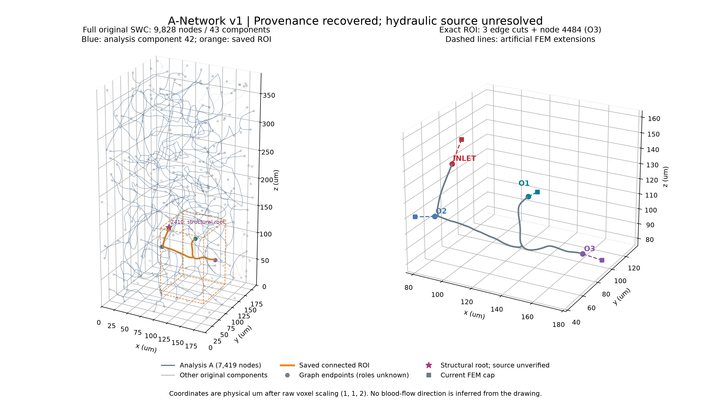

# 一句话结论

**原始 A 图和 ROI 精确来源已恢复，当前阶段是 `A_NETWORK_SOURCE_AMBIGUOUS`。** 结构根 2410 已精确找到，但现有记录只把它作为假定入口；没有找到将它标注为水力源点的数据集证据。外围端点的水力身份也未确认。按本轮源点 STOP 条件，未执行 A 的 operating-point 求解，也未创建或运行新 3D case。 因而还不能回答 O2=85.2% 是否主要由 equal-pressure 截断造成，也不能提供网络分流。

# 完整 A 是怎么变成水管网络的

把每段原 SWC 边视为一根有阻力的水管。半径恒定时 `R=8μL/(πr⁴)`：半径稍变，阻力就会明显变。本轮逐边保留线性半径变化并用稳定解析积分；所有计算内部采用 m、Pa、m³/s。

完整发布文件有 9828 节点/9785 边/43 分量/0 环；历史 analysis A 有 7419/7418/1/0。没有孤立节点、重复 ID、重复坐标、零长边或非正半径。度数分布 1:231、2:9454、3:141、4:2；共 143 个分支节点。最短边 0.555428 μm，最小半径 1 μm。原始单 parent 格式的 0 环不等同生理无环。

# ROI 在完整 A 的哪里

锚点 3274，中心 (130.04,82.04,87.18) μm，80×80×120 μm 盒内只保留锚点连通片。图中星号是**结构根**，没有标成已确认的水力源点。

| Port | 原始 parent→child | t | 真实位置 / μm | 原半径 / μm |
|---|---|---:|---|---:|
| INLET | 3224→3225 | 0.034013605442 | 103.266599, 46.999184, 147.180000 | 1.587390476 |
| O1 | 3307→3308 | 0.371794871795 | 113.417436, 122.040000, 100.410256 | 1.173538462 |
| O2 | 3238→4386 | 0.890909090909 | 90.040000, 48.091273, 110.910909 | 1.152856364 |
| O3 | 4483→4484 | 1.000000000000 | 164.010000, 96.360000, 82.780000 | 1.255000000 |

盒内其他血管共有更多 crossings，但保存的 ROI 只有 3 个 cut 和 O3 原端点，没有第 5 个漏报端口。三个人工切点已精确插入网络副本。

# 完整 A 的边界条件是什么

提出的 outer terminal p=0 只是 gauge/reference。原文件的 43 个结构根、选中分量的唯一结构根 2410 都可以确定；**谁是水力源点尚未确定**。旧脚本显式用 assumed inlet 和 all structural leaves=0，这些旧假设不满足本轮更严格的源点/终端证据要求。

231 个原图端点暂留 UNKNOWN_TERMINAL，保留图像边界距离、球半径是否接边、是否在一体素以内等筛选证据。不是把所有端点叫 physiological outlet，也不是宣称没有真实 outer terminal；当前缺少确认它们身份的数据。

# 为什么要把 ROI inlet 调到 2.0 mm/s

为使网络与原 3D 比较同一个 operating point，需匹配真实 ROI inlet cut 的 Q=1.551359160440232e-14 m³/s，即约 15.513592 pL/s。单位源压解后按 `λ=Q_target/Q_ROI_unit` 缩放；它不是要求整个 A 的入口流量等于 ROI 流量。该逻辑已通过解析测试，尚未用于 A 的未确定边界。

# 完整 A 给出的 ROI pressure 和 flow

| Port | 压力 Pa | 流量 m³/s | 分流比例 |
|---|---|---|---|
| INLET | 未计算 | 未计算（目标见上） | 未计算 |
| O1 | 未计算 | 未计算 | 未计算 |
| O2 | 未计算 | 未计算 | 未计算 |
| O3 | 未计算 | 未计算 | 未计算 |

未计算不是 0；A source pressure/total inflow 同样为 null。

# 当前 zero-pressure ROI 和完整 A 有多大区别

当前 3D 的已知比例仍是 **4.257917% / 85.205026% / 10.537057%**。没有合法 A baseline，不能计算百分点差；Figure 04 未生成。压力图/流量图 Figure 02、03 也不生成；清单见 data/uncomputed_outputs.json。

# O2 为什么多或者为什么不再多

目前无法判定。不能把原比例归因于 geometry、topology 或 zero-pressure BC 中的任何单一因素，也没有预设 O2 必须下降。

# 三个 outlet 能不能用独立 resistance

移除真实 ROI 内部段后，端口外部组件彼此分离；没有外部 outlet-to-outlet 拓扑路径。O1/O2 的远端压力条件仍未确定；O3 外部 degree=0，**没有数据支持一个有限 R3**。Y/Z 数值和 normalized coupling 尚不可用，Figure 05 未生成；原理和拓扑证据见 [ROI_NETWORK_BOUNDARY_MODEL_ZH.md](ROI_NETWORK_BOUNDARY_MODEL_ZH.md)。

# fixed-pressure BC 是什么

本轮 O1/O2/O3 均为 **未定义，禁止使用**。精确 mapping SHA 和 extension 估计已就绪，压力差、gauge shift 结果和 solution SHA 都为空。见 [ROI_FIXED_PRESSURE_BC_ZH.md](ROI_FIXED_PRESSURE_BC_ZH.md)。

# 如果跑了新 3D FEM

未创建、未运行，原因是前置源点/终端条件失败；3D validation split=null，1D–3D 差异不可计算，Figure 06 不生成。没有修改原 production case、几何、网格或 Particle。

# A 自己也是截断数据意味着什么

A 来自一个图像子块，原图端点可能是图像截断或重建终止，并非实际微循环的生理终末。原始数据的 43 个组件有历史来源解释，不是本轮求解失败后偷偷删掉的分量；其中 42 个不参与原 ROI 生成。O3=4484 位于图像内部，尤其不能自动接到公共 p=0 reservoir。

# radius uncertainty

**NO_EMPIRICAL_RADIUS_UNCERTAINTY_AVAILABLE**。已计算几何阻力敏感性，并保存确定性的分支正负 5% 原节点半径图案，没有随机抽一次。分叉共享节点使用最小 incident branch ID，保证每个原节点只有一个半径。source 未识别，所以没有声称完成 full-A 的压力/分流敏感性求解。

| 全局半径倍率 | 精确阻力倍率 |
|---:|---:|
| 0.90 | 1.524158 |
| 0.95 | 1.227738 |
| 1.00 | 1.000000 |
| 1.05 | 0.822702 |
| 1.10 | 0.683013 |

如果边界定义固定、所有半径统一缩放，并重新匹配 ROI inlet Q，线性模型的压力尺度会乘上述因子而分流比例不变；这是解析性质，不是本案例已计算结果。分支 ±5% 的阻力变化范围约 0.822702–1.227738；水力分流敏感性仍被 source gate 阻断。

# terminal uncertainty

MODEL_A 的可信 outer 集合、MODEL_B 的严格 outer 集合都无法认证。若将所有 uncertain 端点设 no-flow，将没有有效 sink；无法匹配正 ROI inlet target。两个模型均明确 invalid/not solved，没有捏造终端敏感性分流。几何候选数量见 data/terminal_sensitivity.json，不能与可信终端数量混用。

# 这是不是生理 ground truth

这不是生理 ground truth；即使后续补齐边界定义，结果也只是 steady Newtonian、geometry-informed 的边界模型。 另有圆管近似、原始半径/截断拓扑、原 SWC-to-STL radius feed 缩放、SV surface remesh、人工延长段估计等限制。未来即便通过边界 gate，1D 与 3D 的曲率、分叉、非圆截面与入口发展也可能导致真实差异。

# 测试、复现与耗时

30 项测试，0 项失败；见 logs/pytest.xml 和 logs/pytest.txt。

本地 WSL、1 worker、4 项线程环境变量均为 1；源图/映射/阻力审计 4.950 s，peak RSS 152.4 MiB（这是脚本耗时，不含人工式来源调查、测试和绘图）。未使用 Vast/GPU。绘图耗时另见 logs/render_metrics.json。

新增科学计算包 `network_1d0d/`，执行/绘图/报告脚本分别在 `scripts/`，永久测试在 `tests/network_1d0d/`。复现命令见 README.md。

Git 分支 `dev/a-network-1d0d-boundary-v1`，起始 HEAD `fd21a850a16d0ba17ef3d521123badd53864a3a2`。进入时已有 1133 个 tracked 改动，本轮没有覆盖；完整前后 git status/diff --stat 在 logs/，本轮新增文件统计单列。

最后检查时检测到已有 `utils/sampling/sampling_io.py` 和 `utils/swc_roi_yaml_config.py` 又发生变化（本轮未编辑它们），当前 tracked diff 增为 1134 个文件。已保存 source helper 审计时/当前哈希，见 logs/concurrent_worktree_changes.json；没有覆盖这些期间变化。40 个受保护的原始/配置/几何/生产输入文件仍全部哈希一致。来源追踪的当前 helper inventory 是审计时快照，不冒称最终工作树逐字节快照。

# 下一步

1. 补充当前 sample 的源点/外围端点标注，或明确声明以结构根 2410 作为理想化源点并选择终端闭合策略；后者属于新的模型假设，不是恢复出来的实测事实。
2. 条件明确后运行单位压差、真实 ROI cut flow scaling、终端/半径敏感性及 Schur audit；复核当前网格的 extension 截面。
3. 全部 gate 通过后，才创建新固定压力 3D case，并如实比较分流。
